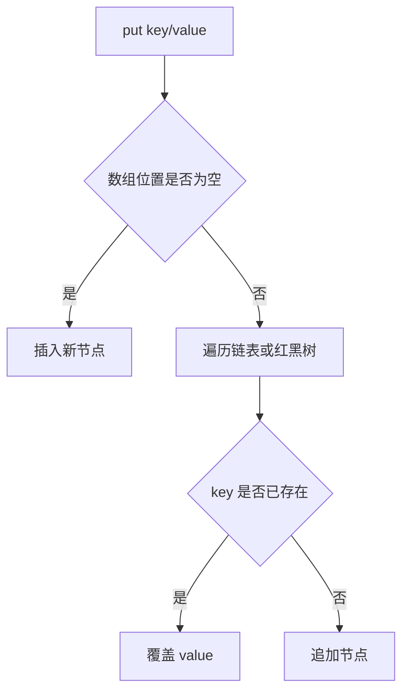

# Repository Specification

> 本文档是本知识库的最高规范。所有目录规划、文档编写、内容迁移、AI 辅助生成、README 维护、图片资源管理、示例代码沉淀和后续重构工作，均应以本文档为准。若局部 README、单篇文章或临时任务说明与本文档冲突，以本文档为准；若确需修改规范，应先修改本文档并记录变更原因。

## 1. 仓库定位

本仓库定位为面向 Java 全栈工程师长期成长的系统化知识库，而不是临时学习笔记、博客合集、问答记录或项目代码仓库。仓库应服务于 5 到 10 年的持续维护，能够承载几千篇 Markdown 文档、上百万字技术内容、多套企业级项目实践材料、面试知识库、架构案例、AI 工程实践和个人历史学习资料。

知识库的核心读者是具备 Java 后端基础、希望成长为高级工程师、架构师或全栈工程师的学习者。内容应覆盖 Java 语言、JVM、并发编程、Spring 生态、数据库、缓存、消息队列、搜索引擎、微服务、分布式系统、架构设计、Linux、Docker、Kubernetes、DevOps、计算机基础、前端工程、AI 工程、C++ 扩展、企业项目实战和面试体系。

本仓库不是单纯记录“学过什么”，而是构建“可以长期查阅、持续扩展、可被 AI 安全续写、可被人类稳定维护”的技术百科。每一篇正式文档都应具备明确边界、稳定标题、统一结构、可验证事实、完整示例、工程视角和可维护链接。

仓库内容分为四类：

1. 正式知识体系：按技术领域和知识点组织，是仓库主体。
2. 项目实战体系：围绕企业项目、场景案例、架构演进、故障复盘组织。
3. 成长与面试体系：包括路线、能力模型、面试题、简历、复盘、求职材料。
4. 历史与个人专题：包括早期 Vue Demo、摄影文档、旧学习路线和归档资料。

正式知识体系必须遵守严格规范。历史资料可以保留原貌，但必须与正式知识体系隔离，避免读者误认为旧 Demo 或早期笔记代表当前最佳实践。

## 2. 设计理念

### 2.1 按知识体系组织，而不是按学习阶段组织

长期知识库不得使用 `phase1`、`phase2`、`阶段一`、`入门阶段` 作为正式目录名称。学习阶段适合课程计划，不适合百科型知识库。正式目录应表达知识所属领域，例如 `01-Java/03-集合框架/03-HashMap.md`，而不是 `Java/笔记/phase1-集合/HashMap.md`。

学习路线可以作为导航文档存在，例如 `00-Governance/03-Learning-Roadmaps/01-Java-Backend-Roadmap.md`，但学习路线不得决定知识文件的物理位置。

### 2.2 一个文件只讲一个稳定知识点

正式文档应遵循“一文一题”。一个文件只讲一个清晰、稳定、可长期维护的知识点。例如：

- `HashMap.md` 只讲 HashMap 的结构、原理、源码、扩容、并发问题和实践。
- `ArrayList.md` 只讲 ArrayList，不混写 LinkedList。
- `MVCC.md` 只讲 MVCC，不同时展开所有事务隔离级别的完整细节。

综合性内容应拆分为目录 README 或专题索引，不应把多个技术点堆在一篇超长文档中。若单篇文档超过 800 行且包含多个独立主题，应考虑拆分。

### 2.3 从工程事实出发，而不是从个人感想出发

正式文档应像技术图书章节、内部工程手册或 Wiki 条目，而不是博客文章。允许说明背景和场景，但不得以情绪化叙述、碎片化日志、聊天记录或“我今天学了什么”的方式组织内容。

文档应优先回答以下问题：

- 这个技术解决什么问题？
- 它的核心概念是什么？
- 它在底层如何实现？
- 它在企业项目中如何使用？
- 它有哪些性能、可靠性、安全性和可维护性风险？
- 它与相邻技术如何比较？
- 面试中如何被考察？

### 2.4 结构稳定优先于短期便利

本仓库未来会被持续扩展。目录、文件名、锚点和交叉引用一旦形成，应尽量稳定。新增内容前应先判断它属于已有目录、需要新建目录、还是应放入归档区。不得因为一篇文档临时方便而破坏整体结构。

### 2.5 人类可读与 AI 可维护并重

仓库应同时服务人类阅读和 AI 辅助写作。统一结构、统一命名、统一章节模板、统一交叉引用规则，能够降低 AI 续写时风格漂移、目录错放、内容重复、粒度失控和格式不一致的风险。

AI 可以辅助生成初稿、补充示例、整理目录和迁移旧文档，但 AI 生成内容必须经过规范检查和事实校验。仓库不接受“看似完整但不可验证”的内容。

## 3. 顶层目录规范

顶层目录采用两位数字前缀加英文技术域名称的方式。数字用于稳定排序，英文用于跨平台兼容和长期链接稳定。若需要中文说明，可写在 README 标题中，不放在目录名中。

推荐顶层结构如下：

```text
00-Governance/
01-Java/
02-Spring-Ecosystem/
03-Database/
04-Redis/
05-Message-Queue/
06-Middleware/
07-Microservices/
08-JVM/
09-Concurrency/
10-Distributed-Systems/
11-Architecture/
12-Linux/
13-Docker/
14-Kubernetes/
15-DevOps/
16-Computer-Science/
17-Frontend/
18-AI-Engineering/
19-Cpp/
20-Project-Practice/
21-Interview/
90-Growth/
98-Personal-Topics/
99-Archive/
assets/
README.md
Repository-Specification.md
Repository-Structure.md
```

顶层目录职责如下：

- `00-Governance/`：仓库规范、路线、模板、写作标准、迁移计划、质量检查清单。
- `01-Java/`：Java 语言本身，包括基础语法、面向对象、集合、泛型、异常、注解、反射、IO、新特性。
- `02-Spring-Ecosystem/`：Spring Framework、Spring Boot、Spring MVC、Spring Security、Spring Cloud、Spring AI 等。
- `03-Database/`：关系型数据库和数据库通用理论，包括 MySQL、PostgreSQL、SQL 优化、事务、索引。
- `04-Redis/`：Redis 数据结构、持久化、高可用、缓存设计、分布式锁和生产调优。
- `05-Message-Queue/`：Kafka、RabbitMQ、RocketMQ、消息可靠性、顺序消息、事务消息、选型。
- `06-Middleware/`：Elasticsearch、Nginx、Netty、注册中心、配置中心、网关等中间件。
- `07-Microservices/`：微服务拆分、服务治理、限流熔断、链路追踪、灰度发布。
- `08-JVM/`：类加载、内存模型、垃圾回收、JIT、故障诊断、调优。
- `09-Concurrency/`：Java 并发、JUC、线程池、锁、无锁、并发容器、并发实践。
- `10-Distributed-Systems/`：CAP、BASE、一致性协议、分布式事务、分布式 ID、幂等、时钟。
- `11-Architecture/`：架构方法论、DDD、设计模式、系统设计、高可用、高性能、高并发、安全架构。
- `12-Linux/`：Linux 使用、进程、文件系统、网络排查、Shell、性能分析。
- `13-Docker/`：镜像、容器、网络、存储、Compose、构建优化。
- `14-Kubernetes/`：Pod、Deployment、Service、Ingress、配置、存储、调度、可观测性。
- `15-DevOps/`：Git、CI/CD、发布、环境治理、监控告警、日志、质量门禁。
- `16-Computer-Science/`：数据结构与算法、操作系统、计算机网络、计算机组成、安全基础。
- `17-Frontend/`：HTML、CSS、JavaScript、TypeScript、Vue3、Node.js、Vite、工程化。
- `18-AI-Engineering/`：Prompt、LLM API、RAG、Embedding、Agent、MCP、评测、部署、安全、成本。
- `19-Cpp/`：C++ 语言、内存、STL、并发、嵌入式、从 Java 到 C++ 的迁移。
- `20-Project-Practice/`：企业级项目实战、业务场景、架构演进、故障复盘、案例库。
- `21-Interview/`：面试体系、题库、答题结构、简历、项目讲解、模拟面试。
- `90-Growth/`：个人成长、学习方法、技术管理、职业规划、复盘模板。
- `98-Personal-Topics/`：非主线但保留价值的个人专题，例如 Olympus EP7 摄影文档。
- `99-Archive/`：历史资料、旧目录、旧学习 Demo、废弃路线、迁移前原文备份。
- `assets/`：全仓库公共图片、图表、附件和示例资源。

顶层目录编号一旦确定，不应频繁调整。新增一级技术域必须满足以下条件：

1. 无法自然归入已有一级目录。
2. 预计长期至少包含 20 篇以上正式文档。
3. 与现有一级目录职责边界清晰。
4. 已在 `Repository-Structure.md` 中补充规划。

## 4. 技术目录规范

技术目录采用“编号 + 中文主题名”的方式，例如：

```text
01-Java/
  01-语言基础/
  02-面向对象/
  03-集合框架/
  04-泛型/
```

一级目录使用英文是为了路径稳定；二级及以下目录可使用中文，以提升阅读体验。技术域内部目录按从基础到原理、从单机到分布式、从使用到生产实践的顺序组织。

每个技术目录必须包含 `README.md`。README 不承载大量正文，不替代具体文章，主要承担导航职责。目录内正式文档使用两位数字前缀，例如 `01-ArrayList.md`。同一目录下编号应连续、稳定，不因删除旧文档而重排已有编号。

目录深度原则：

- 一级目录：技术领域。
- 二级目录：主题模块。
- 三级目录：子主题或系列。
- Markdown 文件：具体知识点。

不建议超过三级目录。若超过三级，通常说明分类过细或主题边界不清。

示例：

```text
01-Java/
  03-集合框架/
    README.md
    01-集合框架总览.md
    02-ArrayList.md
    03-LinkedList.md
    04-HashMap.md
    05-ConcurrentHashMap.md
```

禁止示例：

```text
Java/笔记/phase1-集合/HashMap.md
Java/高级/重要/必看/HashMap详细版最终修改.md
Java/杂项/各种问题.md
```

## 5. README 规范

每个正式目录必须有 README。README 是目录入口，不是内容堆放处。README 应提供当前目录的定位、边界、阅读顺序、文件索引和维护说明。

一级目录 README 推荐结构：

```markdown
# Java

## 目录定位

说明本目录解决什么问题，覆盖哪些知识，不覆盖哪些知识。

## 阅读路径

1. 基础路径
2. 进阶路径
3. 面试路径
4. 企业实践路径

## 内容索引

| 模块 | 说明 | 入口 |
|---|---|---|

## 与其他目录的关系

说明与 JVM、并发、Spring、数据库等目录的边界和引用关系。

## 维护规则

说明新增文档放置规则、命名规则、拆分规则。
```

二级目录 README 推荐结构：

```markdown
# 集合框架

## 模块定位

## 前置知识

## 推荐阅读顺序

## 文档索引

| 序号 | 文档 | 核心问题 |
|---|---|---|

## 常见学习路径

## 维护说明
```

README 禁止事项：

- 禁止写成长篇正文，正文应拆到具体文档。
- 禁止只放文件列表而无定位说明。
- 禁止出现失效链接。
- 禁止混入临时计划、聊天记录、待办碎片。
- 禁止使用“先这样”“以后再整理”等临时表达。

## 6. Markdown 编写规范

### 6.1 标题层级

每篇正式文档必须只有一个一级标题，且一级标题应与文件名主题一致。正文从二级标题开始。标题层级不得跳跃，例如从 `##` 直接跳到 `####`。

推荐结构：

```markdown
# HashMap

## 1. 背景

## 2. 核心概念

## 3. 底层原理

## 4. 实现机制

## 5. 源码分析

## 6. 企业实践

## 7. 性能优化

## 8. 常见错误

## 9. 高频面试题

## 10. 总结

## 11. 延伸阅读
```

编号标题用于正式技术文章，便于引用和维护。若文章较短，也应保留核心章节，但可以合并不适用章节。源码分析仅在主题适用时出现，不能为了模板机械填充。

### 6.2 正文风格

正式文档应使用技术书籍风格。语言要求准确、克制、结构化，不使用口语化、营销化、博客化表达。

推荐表达：

- “HashMap 通过数组、链表和红黑树组合实现键值映射。”
- “在高并发场景下，HashMap 不是线程安全容器，应使用 ConcurrentHashMap 或外部同步机制。”
- “该问题的根因是索引选择性不足，导致优化器选择全表扫描。”

禁止表达：

- “简单来说”
- “大家可以自行搜索”
- “由于篇幅限制”
- “你懂的”
- “这个很简单”
- “面试官最爱问”
- “废话不多说”
- “保姆级教程”
- “一文搞懂”
- “最终版”

可以使用“简要说明”“本节只讨论”“更完整的内容参见”等严谨表达。

### 6.3 列表和表格

列表用于表达并列项，表格用于对比、索引和参数说明。表格应有明确列名，不应为了视觉整齐而使用空列。复杂表格应避免过宽，必要时拆成多个表格。

### 6.4 引用块

引用块用于提示、约束、注意事项或外部定义，不用于大段正文。引用块内容应短小。

示例：

```markdown
> 注意：HashMap 允许一个 null key，但 ConcurrentHashMap 不允许 null key 和 null value。
```

### 6.5 术语

同一术语在全仓库应统一写法。例如：

- `Spring Boot`，不写成 `springboot`。
- `JavaScript`，不写成 `Javascript`。
- `MySQL`，不写成 `mysql`。
- `PostgreSQL`，不写成 `Postgres`，除非讨论命令或社区简称。
- `Kubernetes` 首次出现可写 `Kubernetes（K8s）`，后文可使用 `K8s`。
- `JVM`、`JMM`、`JUC` 使用大写缩写。

术语首次出现时应尽量给出中文解释或英文全称。

## 7. 文件命名规范

正式文档文件名使用：

```text
两位数字-中文主题名.md
```

示例：

```text
01-集合框架总览.md
02-ArrayList.md
03-LinkedList.md
04-HashMap.md
05-ConcurrentHashMap.md
```

文件名要求：

1. 主题明确，避免泛化词。
2. 不使用空格。
3. 不使用版本号、日期、状态词。
4. 不使用“最终版”“新版”“整理版”“详细版”。
5. 不使用问句作为文件名。
6. 不使用特殊符号，必要时仅使用连接号。
7. 英文技术名保持官方大小写。

目录名使用：

```text
两位数字-中文主题名
```

顶层目录例外，使用：

```text
两位数字-English-Domain
```

历史资料、Demo、归档文件可以保留原名，但迁入 `99-Archive/` 时应通过 README 说明来源和状态。

## 8. 知识点拆分原则

拆分知识点时应同时考虑概念边界、工程边界和阅读边界。

### 8.1 应拆分的情况

以下情况应拆分为多个文件：

- 一个文件包含多个可独立检索的技术主题。
- 一个文件同时讲概念、源码、面试和生产案例，篇幅超过 800 行。
- 一个主题可与多个目录交叉引用，但正文只应属于一个主目录。
- 一个文档需要频繁更新，而另一个部分相对稳定。
- 一个章节可以独立成为面试题库或实践手册。

示例：

- `Java集合.md` 应拆为 `集合框架总览.md`、`ArrayList.md`、`LinkedList.md`、`HashMap.md`、`ConcurrentHashMap.md`。
- `MySQL索引和事务.md` 应拆为 `B+树索引.md`、`覆盖索引.md`、`事务隔离级别.md`、`MVCC.md`、`锁机制.md`。

### 8.2 不应拆分的情况

以下情况不应过度拆分：

- 拆分后单篇文档只有几段话，无法形成完整知识单元。
- 两个概念必须同时解释才有意义。
- 主题只是同一个机制的不同小步骤。
- 拆分会导致读者频繁跳转而无法完整理解。

### 8.3 总览文档与专题文档

每个模块允许存在总览文档。总览文档负责建立知识地图，不承载所有细节。专题文档负责深入讲解具体知识点。

总览文档应包含：

- 模块解决的问题。
- 核心概念之间的关系。
- 推荐阅读顺序。
- 与其他模块的交叉引用。
- 常见误区。

专题文档应包含：

- 背景。
- 核心概念。
- 原理与机制。
- 示例。
- 实践。
- 面试。
- 总结。

## 9. 图片资源规范

图片资源不得散落在文档目录中。全仓库公共图片放入 `assets/images/`，技术域专属图片可放入该目录下对应域名目录。

推荐结构：

```text
assets/
  images/
    java/
    spring/
    database/
    redis/
    mq/
    jvm/
    architecture/
    ai-engineering/
    frontend/
    personal/
  diagrams/
  screenshots/
  source/
```

图片命名使用小写英文和连接号：

```text
hashmap-resize-flow.png
mysql-innodb-architecture.png
redis-sentinel-failover.png
spring-mvc-request-flow.png
```

图片引用使用相对路径，并提供有意义的 alt 文本：

```markdown

```

图片使用要求：

1. 技术图优先使用 Mermaid，复杂视觉图再使用图片。
2. 截图必须裁剪掉无关区域。
3. 图片应避免包含敏感信息、账号、密钥、内网地址。
4. 图片源文件可放在 `assets/source/`，便于后续修改。
5. 同一图片不得复制到多个目录，应通过相对路径引用。
6. 图片必须服务于理解，不得使用装饰性图片填充文档。

## 10. Mermaid 使用规范

Mermaid 用于表达结构、流程、状态、时序和依赖关系。正式文档中涉及底层机制、调用链路、架构关系、状态流转时，应优先使用 Mermaid。

常用图类型：

- `flowchart`：流程、机制、执行路径。
- `sequenceDiagram`：请求链路、服务调用、协议交互。
- `classDiagram`：类关系、接口与实现。
- `stateDiagram-v2`：状态机、生命周期。
- `erDiagram`：数据模型关系。
- `mindmap`：知识结构概览。

Mermaid 要求：

1. 图必须有正文说明，不能孤立出现。
2. 节点名称应简短准确。
3. 不在图中塞入大段文字。
4. 图应表达机制，不做装饰。
5. 同一文档中不应堆叠过多图。
6. Mermaid 语法应能被主流 Markdown 工具渲染。

示例：



## 11. 代码示例规范

代码示例必须完整、可读、可运行或接近可运行。不得只放无法理解的片段。示例应服务于知识点，不追求炫技。

Java 示例要求：

1. 标明 JDK 版本或适用范围。
2. 类名、方法名、变量名语义清晰。
3. 示例应能单独复制到 IDE 中理解。
4. 涉及并发、IO、网络、数据库时，应说明资源关闭、异常处理和线程安全。
5. 不使用无意义命名，例如 `test1`、`aaa`、`foo`。
6. 不在示例中硬编码真实密码、Token、生产地址。

示例格式：

```java
public class HashMapCapacityExample {
    public static void main(String[] args) {
        Map<String, Integer> scoreMap = new HashMap<>(16);
        scoreMap.put("alice", 90);
        scoreMap.put("bob", 85);

        System.out.println(scoreMap.get("alice"));
    }
}
```

Spring 示例要求：

- Controller、Service、Repository 分层清晰。
- 配置项给出必要说明。
- 示例不应把业务逻辑全部写在 Controller。
- 涉及事务时应说明传播行为、隔离级别和失效场景。

SQL 示例要求：

- 给出表结构、索引、查询语句和预期解释。
- 涉及优化时应说明优化前后差异。
- 不给出不可验证的性能结论。

Shell 示例要求：

- 命令应说明执行环境。
- 危险命令必须写明风险。
- 不提供破坏性命令作为默认操作。

## 12. 源码分析规范

源码分析只在主题适用时出现。源码分析不是简单复制源码，而是解释关键路径、核心数据结构、设计取舍和版本差异。

源码分析要求：

1. 标明源码版本，例如 JDK 17、Spring Framework 6.x、Spring Boot 3.x。
2. 只引用必要片段，不大段粘贴源码。
3. 先说明问题，再进入源码。
4. 解释调用链路和关键分支。
5. 标注容易误解的实现细节。
6. 给出源码分析结论和工程意义。

源码分析结构推荐：

```markdown
## 源码分析

### 分析目标

### 入口方法

### 核心流程

### 关键数据结构

### 版本差异

### 工程结论
```

## 13. 文档交叉引用规范

交叉引用用于建立知识网络。引用必须准确、必要、稳定。

引用格式：

```markdown
参见：[ConcurrentHashMap](../03-集合框架/05-ConcurrentHashMap.md)
```

引用规则：

1. 优先使用相对路径。
2. 引用标题应与目标文档主题一致。
3. 不引用不存在的文件。
4. 不使用绝对本地路径。
5. 不使用外部链接替代仓库内已有内容。
6. 大量相关链接应放在“延伸阅读”或“相关文档”章节。

跨目录引用必须有边界意识。例如 HashMap 文档可以引用 JVM 内存模型、并发容器、红黑树，但不应把这些内容完整复制到 HashMap 文档中。

## 14. AI 生成规范

AI 可以参与仓库建设，但必须遵守仓库规范。

AI 生成正式文档前必须确认：

1. 目标目录是否符合 `Repository-Structure.md`。
2. 文件是否已有同主题文档。
3. 文档粒度是否满足“一文一题”。
4. 是否需要复用已有内容。
5. 是否存在历史资料可迁移。
6. 是否需要图片、Mermaid 或代码示例。

AI 生成文档时必须遵守：

- 不使用问答体作为正式正文。
- 不写博客式标题。
- 不使用“简单来说”“由于篇幅限制”“建议自行搜索”等表达。
- 不编造源码、版本、性能数据或案例。
- 不把多个知识点塞入一个文件。
- 不生成无法运行或无上下文的代码片段。
- 不随意删除旧内容。
- 不修改仓库规范，除非任务明确要求。

AI 生成内容后必须自检：

1. 标题层级是否正确。
2. 文件命名是否合规。
3. 是否包含必须章节。
4. Mermaid 是否语法合理。
5. 代码示例是否完整。
6. 链接是否存在。
7. 是否有禁用表达。
8. 是否出现事实不确定但未标注的内容。

若 AI 不确定某个事实，应使用“需要依据具体版本确认”或查阅官方资料后再写，不得直接给出确定结论。

## 15. Cursor / Codex 工作规范

使用 Cursor、Codex 或其他 AI 编程助手维护仓库时，应遵守以下流程。

### 15.1 修改前

1. 读取 `Repository-Specification.md`。
2. 读取 `Repository-Structure.md`。
3. 检查目标目录 README。
4. 搜索是否已有同主题文档。
5. 明确本次任务属于新增、迁移、重构、修订还是校对。

### 15.2 修改中

1. 保持改动范围清晰。
2. 不混合多个无关主题。
3. 不批量删除历史资料。
4. 迁移旧内容时保留有效信息，剔除重复和过时表达。
5. 更新文件后同步更新目录 README。
6. 新增图片时放入规范资源目录。
7. 新增交叉引用时确认目标存在。

### 15.3 修改后

1. 检查 Markdown 渲染。
2. 检查链接。
3. 检查标题层级。
4. 检查禁用表达。
5. 检查 README 索引。
6. 记录迁移来源或重要变更。

### 15.4 AI 协作边界

AI 可以：

- 重构目录。
- 整理 README。
- 生成规范文档。
- 扩写技术文章。
- 迁移旧笔记。
- 增加 Mermaid 图。
- 补充代码示例。
- 检查风格一致性。

AI 不应：

- 伪造生产经验。
- 伪造源码结论。
- 删除用户历史资料。
- 随意改变一级目录规划。
- 将未验证内容写成确定事实。
- 将临时聊天记录直接保存为正式文档。

## 16. 更新规范

仓库更新分为以下类型：

- 新增：新增正式文档、README、图片或模板。
- 修订：修正文档内容、补充示例、更新版本信息。
- 迁移：将旧目录内容移动到新结构，并保留来源说明。
- 归档：将过时、重复或历史资料移动到 `99-Archive/`。
- 重构：调整目录、拆分文档、合并重复内容。
- 校对：修复错别字、格式、链接、标题层级。

每次更新应尽量保持单一目的。一次任务不应同时大规模迁移 Java、重写 AI 工程、整理摄影资料和生成新文章。

重要更新应在相关 README 中留下维护说明，例如：

```markdown
## 维护记录

- 2026-07-01：从旧 `01-Java/03-集合框架/` 迁移集合框架内容。
```

当技术版本变化时，应优先更新受影响文档。例如 Spring Boot 2 到 Spring Boot 3 涉及 Jakarta 命名空间变化，应在相关文档中明确版本边界。

## 17. 禁止事项

以下行为在正式知识体系中禁止：

1. 使用学习阶段作为正式目录。
2. 将多个知识点混写成一篇杂文。
3. 使用 AI 问答体保存正式文档。
4. 使用博客化标题和营销化表达。
5. 使用“简单来说”“由于篇幅限制”“建议自行搜索”等敷衍表达。
6. 复制大段源码而不分析。
7. 复制外部内容而不注明来源。
8. 编造性能数据、版本特性或企业案例。
9. 将 Demo 代码混入正式知识目录。
10. 将图片散落在各处。
11. 新增文档后不更新 README。
12. 修改文件名后不修复引用。
13. 使用本地绝对路径作为文档链接。
14. 删除历史资料而不归档。
15. 在正式文档中保留 TODO、TBD、未完成草稿标记。
16. 将面试题答案写成背诵口吻而不解释原理。
17. 将个人简历、求职追踪与正式技术文档混放。
18. 在代码示例中暴露密钥、账号、生产地址。
19. 使用不可运行、不可解释的代码片段冒充示例。
20. 无依据地评价某技术“最好”“最强”“必用”。

## 18. 质量验收标准

正式文档进入知识库前，应满足以下标准。

### 18.1 结构标准

- 文件位置符合目录规划。
- 文件名符合命名规范。
- 只有一个一级标题。
- 标题层级连续。
- 包含必要章节。
- README 已更新。

### 18.2 内容标准

- 主题边界清晰。
- 背景、概念、原理、实践完整。
- 关键术语解释准确。
- 代码示例完整。
- Mermaid 图与正文匹配。
- 企业实践具有工程价值。
- 常见错误具体可操作。
- 面试题有原理支撑。

### 18.3 事实标准

- 版本信息明确。
- 源码分析基于真实版本。
- 性能结论有条件边界。
- 外部资料有来源。
- 不确定内容明确标注。

### 18.4 风格标准

- 语言克制、准确、成体系。
- 不使用禁用表达。
- 不使用问答聊天体。
- 不使用营销化标题。
- 不堆砌无解释术语。

### 18.5 可维护标准

- 链接有效。
- 图片路径有效。
- 目录索引有效。
- 文档粒度适中。
- 与其他文档没有明显重复。
- 后续可继续扩展。

## 19. 迁移旧内容的原则

现有仓库中已经存在大量有价值内容，包括 Java phase 笔记、数据与中间件、AI 工程、计算机基础、C++ 嵌入式、Vue Demo、Olympus EP7 摄影文档和技术成长资料。迁移时应遵循“复用优先、归档兜底、正式内容重构”的原则。

旧内容处理方式：

- Java phase 笔记：拆分迁移到 `01-Java/`、`08-JVM/`、`09-Concurrency/`、`02-Spring-Ecosystem/`、`03-Database/`、`10-Distributed-Systems/`、`11-Architecture/`、`15-DevOps/`。
- 数据与中间件：迁移到 `03-Database/`、`04-Redis/`、`05-Message-Queue/`、`06-Middleware/`。
- 计算机基础：迁移到 `16-Computer-Science/`。
- AI 工程：迁移到 `18-AI-Engineering/`。
- C++ 嵌入式：迁移到 `19-Cpp/`，求职资料迁移到 `21-Interview/` 或 `90-Growth/`。
- Vue Demo：保留到 `99-Archive/Frontend-Demos/Vue2-Basic/`，正式前端知识重新规划到 `17-Frontend/`。
- Olympus EP7：保留到 `98-Personal-Topics/Photography/Olympus-EP7/`。
- 旧学习路线和复盘：迁移到 `90-Growth/` 或 `99-Archive/`。

迁移不得简单移动文件完事。正式迁移应完成命名、结构、README、链接和内容风格修正。若暂时无法重构，可先放入归档区，并在 README 中说明“未按正式规范整理”。

## 20. 文档生命周期

每篇正式文档有以下生命周期：

1. Planned：已在 `Repository-Structure.md` 中规划，但尚未创建。
2. Draft：已有初稿，但未达到正式质量。
3. Stable：达到正式质量，可作为知识库正文。
4. Needs-Update：因版本变化、结构调整或事实更新需要修订。
5. Archived：不再作为正式内容维护，但保留历史价值。

生命周期状态不建议写在文件名中，可在 README 索引表中以状态列表示。

## 21. 模板规范

正式技术文档推荐模板：

```markdown
# 文档标题

## 1. 背景

## 2. 核心概念

## 3. 底层原理

## 4. 实现机制

## 5. Mermaid 图解

## 6. 完整代码示例

## 7. 源码分析

## 8. 企业实践

## 9. 性能优化

## 10. 常见错误

## 11. 高频面试题

## 12. 总结

## 13. 延伸阅读
```

若某章节不适用，可以删除或合并，但不得因省事省略核心解释。面试题不应只给答案，应说明考察点、答题结构和关键风险。

## 22. 最终维护目标

本仓库最终应达到以下状态：

- 目录结构稳定清晰，读者无需解释即可找到内容。
- Java 全栈主线完整，覆盖从基础到架构的知识体系。
- 每篇文档粒度明确，可独立阅读，也可通过 README 串成路线。
- 历史资料被妥善保留，但不干扰正式知识体系。
- AI 可以依据规范持续生成一致风格的文档。
- README 成为可靠导航，而不是失效链接集合。
- 技术内容具备图书级结构、Wiki 级可检索性和企业手册级实践价值。

本规范是仓库长期维护的基础。任何新增文档、目录调整和批量迁移，都应先确认是否符合本文档。
