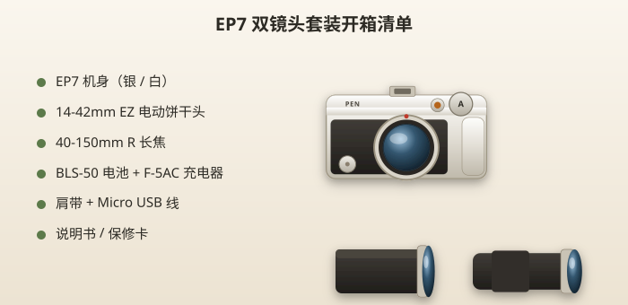
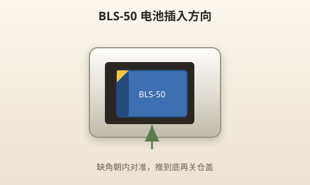
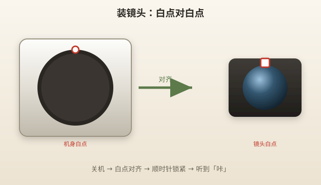
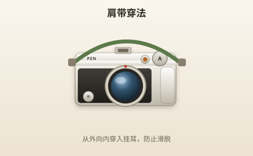
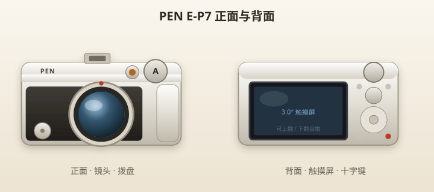

# 第一次拿到 EP7

> 本章目标：安全完成开箱、装镜头、充电、插卡，拍第一张测试照片。

---

## 开箱清单

打开包装盒，确认以下物品是否齐全：

| 物品 | 数量 | 备注 |
|------|------|------|
| Olympus PEN E-P7 机身 | 1 | 有银色、白色可选 |
| BLS-50 锂电池 | 1 | 出厂可能未充满 |
| F-5AC USB 电源适配器 | 1 | 用于充电 |
| USB 数据线（Micro USB） | 1 | 连接相机与充电器 |
| 肩带 | 1 | 建议装上再用 |
| 14-42mm EZ 镜头 | 1 | 电动饼干变焦，可能已预装 |
| 40-150mm R 镜头 | 1 | 长焦，单独包装 |
| 说明书 / 保修卡 | 若干 | 可备查，日常以本教程为主 |

> 💡 **小技巧**：先不要扔掉所有包装。镜头原装前后盖、缓冲材料旅行时还能用。



> 📷 **建议图片**：所有配件平铺在桌面上的俯拍，标注每个物品名称。

---

## 认识包装盒里的「三件套」

### 机身

EP7 是一台 **Micro Four Thirds（M4/3）** 无反相机。没有反光镜，比单反轻很多；**没有内置取景器**，所有构图都靠背后那块可翻转触摸屏。

### 14-42mm EZ

日常「挂机头」。非常薄，像块饼干，适合放包里随身带。变焦是**电动**的——转变焦环时镜头会伸长，关机后会自动缩回。

### 40-150mm R

轻量长焦。等效 80～300mm，拍远处的人、动物、舞台很有用。比 14-42 长一截，但放在包里不占太多地方。

---

## 第一步：给电池充电

1. 打开机身底部电池仓盖
2. 按指示方向插入 BLS-50 电池（缺角对准）
3. 关上仓盖
4. **关机**状态下，用 USB 线连接相机与 F-5AC 充电器，插入插座
5. 充电指示灯亮起；约 **4 小时** 充满后灯灭

> ⚠️ **注意**
> - 充电时相机必须**关机**，开机状态下不会充进电
> - 也可另购 BCS-5 座充（约 3.5 小时充满），出门备用电池更方便



> 📷 **建议图片**：电池仓打开，标注电池正确插入方向。

---

## 第二步：插入 SD 存储卡

1. 打开同一侧（底部或侧面）的 **SD 卡槽**
2. 卡标签朝外，金手指朝内，推入至卡住
3. 关好卡槽盖

| 推荐规格 | 说明 |
|---------|------|
| 容量 | 64GB 或 128GB |
| 速度 | UHS-I U3 或 UHS-II |
| 品牌 | 闪迪、三星、金士顿等主流即可 |

拍 4K 视频建议 U3 及以上。纯拍照，Class 10 也够用。

> 💡 **小技巧**：备一张备用卡。旅行时卡满了或损坏，有备无患。

---

## 第三步：安装 14-42mm EZ 镜头

**第一次建议装 14-42**，它是最常用的标准镜头。

### 操作步骤

```
1. 关闭相机电源（拨到 OFF）
2. 拆下机身卡口盖、镜头后盖——后盖收好别丢
3. 镜头卡口上的白点 对准 机身上白点
4. 镜头插入卡口，顺时针轻轻转动，听到「咔」一声即锁紧
5. 开机——EZ 镜头会自动伸出至工作位置
```



> 📷 **建议图片**：镜头与机身白点对齐的特写；或装镜头过程的连拍。

### 新手最容易犯的错

| 错误 | 后果 | 正确做法 |
|------|------|---------|
| 开机状态下换镜头 | 传感器进灰风险大 | **先关机** |
| 白点没对齐硬拧 | 损坏卡口 | 对齐后再转 |
| 没听到锁紧声就开机 | 镜头可能掉落 | 确认「咔」一声 |
| 用手摸镜头前组玻璃 | 留下指纹油污 | 只握镜身 |

---

## 第四步：装肩带

肩带穿入机身上两个挂耳。建议用「从外向内」的穿法，防止肩带意外滑脱——具体可参考官方说明书肩带穿法图。



> 📷 **建议图片**：肩带正确穿法的特写。

---

## 第五步：第一次开机

1. 模式转盘转到 **iAUTO**（全自动，通常标记为绿色相机图标）
2. 电源拨杆拨到 **ON**
3. 14-42 EZ 会轻微「嗡」一声伸出——这是正常的
4. 按提示选择语言、日期时间


> 📷 **建议图片**：模式转盘指向 iAUTO；或开机后日期时间设置界面。

---

## 第六步：拍第一张测试照片

1. 镜头对准房间里的静物（杯子、书本、玩偶）
2. 屏幕轻触你想对焦的位置
3. 半按快门——对焦框变绿表示合焦
4. 完全按下快门
5. 按 **播放键**（▶ 三角形）查看照片

### 检查这三件事

- [ ] 照片没有黑屏（镜头盖摘了吗？）
- [ ] 主体是清晰的（快门速度够快吗？）
- [ ] 亮度大致正常（太暗或太亮先别管，后面会学）

---

## 40-150mm 镜头先别急着装

长焦镜头留到熟悉 14-42 之后再装。你需要先练会：

- 关机换镜头
- 基本对焦
- 回放删除废片

---

## 机身各部位速览

```
        [热靴/闪光灯]
    [模式转盘]  [电源开关]
  ┌─────────────────────┐
  │  OLYMPUS PEN        │  ← 正面：镜头、Profile 拨盘（左下）
  │      [镜头]         │
  └─────────────────────┘

  背面：3 英寸触摸屏（可上翻 80°、下翻 180° 自拍）
        十字键、MENU、INFO、AEL/AFL、播放、删除
```



> 📷 **建议图片**：机身正、背两面产品照，标注主要区域。

---

## 实战 walkthrough：开箱到第一张照片（20 分钟）

跟着做一遍，全程不用查其他章节。每一步都有「做什么 + 看到什么才算对」。

### 阶段一：通电（约 5 分钟 + 充电等待）

```
步骤 1｜插电池
  → 底盖打开，BLS-50 缺角对准推到底，听到卡扣
  → 看到什么：盖子能轻松合上，不顶

步骤 2｜插 SD 卡
  → 标签朝外推入，听到「咔」
  → 看到什么：卡不外露、盖能关

步骤 3｜充电（关机）
  → USB 线接 F-5AC，插座通电
  → 看到什么：机身指示灯亮 = 正在充；灯灭 = 充满
```

> ✅ **检查点**：若插上没反应 → 确认相机**关机**（开机不充电）、换个 USB 口。

### 阶段二：开机与基础引导（约 3 分钟）

```
步骤 4｜转到 iAUTO（绿色相机图标），电源拨到 ON
  → 看到什么：14-42 轻微「嗡」一声伸出，屏幕亮

步骤 5｜按屏幕提示选「简体中文」→ 设日期时间
  → 看到什么：进入实时取景画面，能看到镜头前的景象
```

> ✅ **检查点**：屏幕全黑？→ 镜头盖没摘 / 镜头没伸出（重新开关机）。

### 阶段三：第一张照片（约 5 分钟）

```
步骤 6｜镜头对准桌上静物（杯子、书）
步骤 7｜手指点屏幕上的主体 → 出现对焦框
步骤 8｜半按快门 → 对焦框变绿 + 「滴」一声
步骤 9｜完全按下快门 → 屏幕闪一下 = 已拍
步骤 10｜按 ▶ 播放键 → 看到刚拍的照片
```

### 阶段四：三项验收

| 检查 | 合格标准 | 不合格怎么办 |
|------|---------|-------------|
| 清晰 | 放大主体边缘锐利 | 快门太慢→靠窗更亮处再拍 |
| 曝光 | 不死黑不死白 | 太暗→靠窗；太亮→别对着窗 |
| 对焦 | 主体清背景可虚 | 框没变绿别按到底 |

> 🎯 **毕业标准**：能独立完成步骤 6～10，并拍出 1 张清晰照片，本章就通关了。

---

## 常见开箱问题速查

| 现象 | 原因 | 处理 |
|------|------|------|
| 开机镜头不伸出 | 镜头没锁紧 / 电量过低 | 重新锁镜头、先充电 |
| 屏幕提示「无存储卡」 | 卡没插到位 | 重插到「咔」 |
| 拍完没声音没反馈 | 静音模式 | 转 iAUTO 重试 |
| 时间不对 EXIF 乱 | 没设日期 | MENU→扳手→日期时间 |

---

## 本章重点回顾

- 开箱确认：机身、两镜头、电池、充电器、肩带、SD 卡
- 充电必须**关机**，约 4 小时
- 装镜头：**关机 → 白点对白点 → 顺时针锁紧 → 开机**
- 第一次用 **iAUTO** 模式拍测试照
- 40-150 等熟悉后再装

## 常见误区

| 误区 | 真相 |
|------|------|
| 「镜头没伸出来就是坏了」 | EZ 关机后会缩回，开机自动伸出 |
| 「充电时可以顺便开机看看」 | 开机时不会充电 |
| 「SD 卡随便插」 | 推到底卡住，别用蛮力 |
| 「两个镜头可以同时装」 | 一次只能装一支 |

## 拍摄练习

1. **充电练习**：插入电池，连接充电器，观察指示灯
2. **装拆镜头 3 次**：每次关机，练到 30 秒内完成
3. **iAUTO 拍 10 张**：不同距离、不同光线
4. **回放练习**：播放、放大检查、删除 2 张最糊的
5. **熟悉按键位置**：闭着眼摸出快门、播放、删除键

完成以上练习后，进入 [02-认识EP7.md](02-认识EP7.md)。
