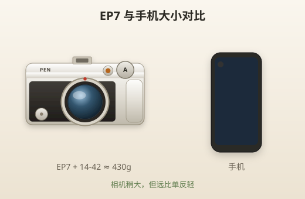

# 认识 EP7

> 本章目标：知道 EP7 是什么、强在哪、弱在哪，以及它是否适合你。

---

## EP7 是什么？

Olympus PEN E-P7（2021 年 6 月发布）是 OM System（原奥林巴斯）PEN 系列的一台 **入门级无反相机**。

几个关键特征：

| 特征 | 说明 |
|------|------|
| 传感器 | 2000 万像素 M4/3 Live MOS |
| 处理器 | TruePic VIII |
| 防抖 | 5 轴机身防抖，约 4.5 档 |
| 屏幕 | 3 英寸触摸屏，104 万点，可翻转自拍 |
| 取景器 | **无**（靠屏幕构图） |
| 重量 | 约 337g（含电池和卡） |
| 连拍 | 最高约 8.7 张/秒 |
| 视频 | 4K 30p |



> 📷 **建议图片**：EP7 加 14-42 镜头与手机并排，展示体积。

---

## 为什么很多人喜欢 EP7？

### 1. 颜值即正义

复古 PEN 造型、金属质感、银白配色——很多人买它就是因为「好看」。愿意带出门的相机，才是好相机。

### 2. 真的轻

机身 + 14-42 EZ 大约 **430g**，比一罐可乐还轻。旅行、逛街挂脖子或放小包都不累赘。

### 3. 色彩直出好看

奥林巴斯/OM System 的 JPEG 色彩一向口碑不错。机内还有 **色彩配置文件** 和 **16 种艺术滤镜**，不想后期也能出片。

### 4. 防抖很强

5 轴防抖约 4.5 档，意味着你可以用更慢的快门手持拍摄。新手最怕手抖，EP7 帮你兜很大一部分底。

### 5. 镜头生态丰富

M4/3 卡口镜头选择多。你的 14-42 + 40-150 双套头已经覆盖 28～300mm 等效焦段，性价比极高。

---

## Micro Four Thirds 是什么？

一句话：**一种相机和镜头的「接头标准」**。

```
全画幅传感器  ████████████████  （最大，景深最浅，机身往往最大）
APS-C 传感器  ██████████        （中等）
M4/3 传感器   ████████          （EP7 用这个，边长约 17×13mm）
手机传感器    ██                （最小）
```

### 等效焦段 ×2

M4/3 传感器比全画幅小，所以有一个「等效系数 2×」：

| 镜头标注 | 等效全画幅视角 |
|---------|--------------|
| 14mm | 28mm（广角） |
| 42mm | 84mm（中焦） |
| 150mm | 300mm（长焦） |

**你不需要背公式**。记住：14-42 适合日常，40-150 适合「拉近远处的」。

### 对新手意味着什么？

| 优点 | 说明 |
|------|------|
| 机身镜头更小 | 愿意带出门 |
| 长焦更轻便 | 300mm 等效才 190g |
| 景深相对深 | 同光圈下背景不如全画幅虚——但人像仍够用 |

| 相对弱项 | 说明 |
|---------|------|
| 高 ISO 噪点 | 比全画幅明显，但 ISO 3200 以内日常够用 |
| 极致背景虚化 | 需要 F1.8 大光圈定焦才更明显 |
| 暗光极限 | 有防抖补，但不如大传感器 |

---

## EP7 的优点（结合你的套装）

| 优点 | 实际体验 |
|------|---------|
| 轻便 | 双镜头放一个小包即可 |
| 防抖 | 室内、黄昏手持成功率更高 |
| 翻转屏 | 自拍、低角度、高角度都方便 |
| 触控对焦 | 和手机一样点哪对哪 |
| 艺术滤镜 | 直出创意照，免 App 滤镜 |
| USB 充电 | 充电宝也能给相机充 |
| 静音快门 | 博物馆、婚礼部分场景可用 |

---

## EP7 的不足（买前/用前要知道）

| 不足 | 影响 | 应对方法 |
|------|------|---------|
| 无取景器 | 大太阳下屏幕看不清 | 找阴影、戴帽子挡光、调高亮度 |
| 不防尘防滴 | 下雨、沙滩要小心 | 雨天套塑料袋；别换镜头 |
| 反差对焦 | 追焦不如高端机型 | 拍小孩宠物用连拍+提前量 |
| 4K 无机身防抖协同 | 拍视频手持会抖 | 用三脚架或裁切 1080p |
| 单卡槽 | 卡坏=数据全丢 | 重要行程备双卡、及时备份 |
| 菜单复杂 | 新手迷路 | 跟本教程「必改清单」走 |

> ⚠️ **诚实说**：如果你主要拍**高速运动**（赛车、飞鸟）或**专业商业人像**，EP7 不是最优选。但旅行、记录生活、入门学摄影——非常合适。

---

## 适合什么人？

✅ **非常适合**

- 从手机升级、想要更好画质但怕太重
- 旅行、街拍、美食、家人朋友记录
- 在意相机外观，愿意随身带
- 不想学复杂后期，希望直出好看
- 预算有限，双套头一机走天下

✅ **也可以，但有预期**

- 夜景爱好者（能拍，但要学会控制 ISO）
- Vlog 入门（4K 可用，无麦克风接口是短板）
- 演唱会后排（40-150 能拍，但光圈小、高 ISO 有噪点）

---

## 不适合什么人？

❌ **可能不合适**

- 强烈需要取景器（阳光户外的职业拍摄）
- 主要拍体育/野生动物高速追焦
- 追求极致暗光画质（经常 ISO 12800+）
- 需要双卡备份的专业商拍
- 重度视频创作（无耳机麦接口、4K 裁切大）

---

## EP7 vs 手机：差在哪？

| 对比项 | 手机 | EP7 + 镜头 |
|--------|------|-----------|
| 传感器 | 小 | 大很多 |
| 光学变焦 | 多数靠数码裁切 | 40-150 真光学 300mm |
| 背景虚化 | 算法模拟，边缘易穿帮 | 物理光学，更自然 |
| 暗光 | 计算摄影很强 | 靠大传感器+防抖，各有胜负 |
| 操控 | 极简 | 需学习，但更可控 |
| 便携 | 口袋 | 小包 |

**新手常见失望**：「为什么不如手机亮？」—— 因为手机默认 HDR+算法，相机默认更「真实」。学会曝光补偿和后期，差距就拉开了。

---

## 你的双镜头套装能拍什么？

| 场景 | 14-42 EZ | 40-150 R |
|------|----------|----------|
| 餐厅美食 | ⭐⭐⭐ | ❌ 太近 |
| 旅行合影 | ⭐⭐⭐ | ⭐ |
| 远处建筑 | ⭐ | ⭐⭐⭐ |
| 动物园 | ⭐ | ⭐⭐⭐ |
| 儿童室内 | ⭐⭐⭐ | ⭐ |
| 演唱会 | ❌ | ⭐⭐ |
| 月亮 | ❌ | ⭐（需三脚架） |
| 人像半身 | ⭐⭐⭐ | ⭐⭐ |

详细镜头章节见 [05-14-42EZ镜头.md](05-14-42EZ镜头.md) 和 [06-40-150R镜头.md](06-40-150R镜头.md)。

---

## 品牌更名说明

2021 年起影像部门品牌逐步改为 **OM SYSTEM**。你的 EP7 机身上可能仍印 OLYMPUS PEN，菜单里也可能是 OLYMPUS——**功能完全相同**，固件更新从 OM System 官网下载即可。

---

## 实战 walkthrough：用 3 个实拍案例读懂 EP7 的强项

与其背参数，不如各拍一张，直观感受相机比手机强在哪。三个案例都用 **A 模式**（下一章详解，这里照抄参数即可）。

### 案例 A：真实光学虚化（手机算法比不了的边缘）

```
镜头：14-42 @ 42mm
模式：A，光圈 F5.6
主体：一个杯子/玩偶，放桌子边缘
背景：离主体 1.5m 以上（越远越虚）
动作：靠近主体到 0.5m，对焦主体
```

> 对比：同场景用手机「人像模式」拍一张。放大看主体**边缘**（头发、把手）——手机算法常在边缘穿帮，EP7 是光学虚化，过渡自然。

### 案例 B：光学长焦（把远处拉到眼前）

```
镜头：换 40-150 @ 150mm（等效 300mm）
模式：A，F5.6
主体：50m 外的招牌 / 对岸建筑
动作：站稳，半按对焦，快门≥1/250
```

> 对比：手机同一位置拉到最大。手机多为数码裁切，放大就糊；EP7 是真光学，细节清楚得多。

### 案例 C：防抖暗光手持（不糊的极限）

```
镜头：14-42 @ 14mm，F3.5
模式：A，ISO AUTO（上限 3200）
场景：室内较暗的角落
动作：双手夹紧、屏息，轻按快门
```

> 感受：EP7 的 5 轴防抖让 1/10～1/20 秒手持也常能出清晰片——这是它「愿意带出门也能拍」的底气。

### 三案例对照

| 案例 | 关键设置 | 你会明白 |
|------|---------|---------|
| A 虚化 | 42mm + F5.6 + 靠近 | 光学虚化更自然 |
| B 长焦 | 40-150 @ 150mm | 光学变焦碾压手机数码变焦 |
| C 防抖 | 14mm + ISO AUTO | 暗光手持成功率 |

> 🎯 **目的**：不是拍大片，是**亲手验证**「为什么要用相机而不是手机」。拍完你就知道该在什么场景掏出 EP7。

---

## 本章重点回顾

- EP7 = 轻便、好看、防抖强的 M4/3 入门无反
- 无取景器是最大的使用环境限制
- M4/3 等效焦段 ×2，你的套装覆盖 28～300mm
- 适合旅行、生活记录；不适合专业体育/极致暗光
- 比手机强在光学变焦、真实虚化、可控性

## 常见误区

| 误区 | 真相 |
|------|------|
| 「像素越高越好」 | 2000 万对打印 A3 足够 |
| 「小传感器就是垃圾」 | 轻便+防抖+镜头，整体体验很好 |
| 「必须买定焦才专业」 | 双套头先把焦段用熟 |
| 「EP7 是老相机了」 | 2021 年发布，仍是最新 PEN 线 |

## 拍摄练习

1. 称一下你的 EP7+14-42 重量，和手机对比
2. 在强光下看屏幕，感受「无取景器」的实际影响
3. 打开艺术滤镜拍 3 张，体验直出色彩
4. 列出你最常拍的 5 种场景，对照上表看该用哪支镜头

下一章：[03-第一次开机设置.md](03-第一次开机设置.md)
