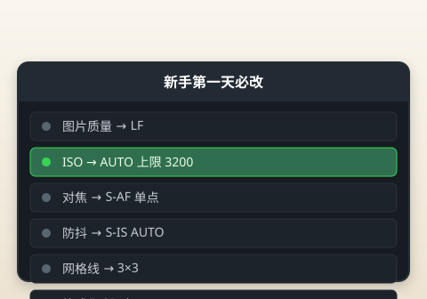
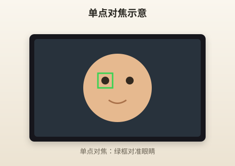
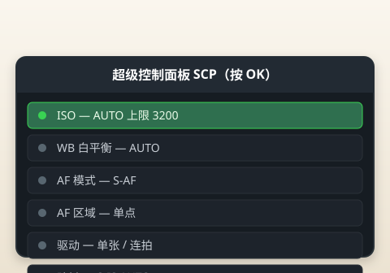

# 第一次开机设置

> 本章目标：完成 10 项「开机必做」设置，让 EP7 处于最适合新手的状态。

---

## 开始之前

- 电池已充满或至少有 50% 电量
- SD 卡已插入
- 14-42 EZ 已安装
- 模式转盘在 **P** 或 **A**（设置菜单时比 iAUTO 自由）



> 📷 **建议图片**：设置菜单首页截图，或本教程设置清单打印版。

---

## 必做设置清单（10 项）

| 序号 | 设置项 | 推荐值 | 优先级 |
|------|--------|--------|--------|
| 1 | 日期与时间 | 准确 | ⭐⭐⭐ |
| 2 | 图片质量 | LF（大 JPEG） | ⭐⭐⭐ |
| 3 | ISO 上限 | AUTO，最高 3200 | ⭐⭐⭐ |
| 4 | 防抖 | 开启 S-IS AUTO | ⭐⭐⭐ |
| 5 | 对焦模式 | S-AF 单次对焦 | ⭐⭐⭐ |
| 6 | 对焦点 | 单点，可触控 | ⭐⭐⭐ |
| 7 | 白平衡 | AUTO | ⭐⭐ |
| 8 | 网格线 | 开启 | ⭐⭐ |
| 9 | 格式化 SD 卡 | 新卡必做 | ⭐⭐⭐ |
| 10 | 固件版本 | 检查更新 | ⭐ |

下面逐项说明**为什么要这样设**。

---

## 1. 日期与时间

**路径**：MENU → 扳手图标（设置）→ 日期/时间

照片 EXIF 信息依赖正确时间。旅行跨时区记得改。

> 💡 **小技巧**：开启「保留日期」——换电池时时间不会乱。

---

## 2. 图片质量：LF

**路径**：MENU → 相机图标 → 图片质量 → **LF**

| 选项 | 含义 | 新手建议 |
|------|------|---------|
| LF | 大 JPEG，约 20MP | ✅ **默认用这个** |
| LN | 标准 JPEG，稍小 | 卡空间紧张时 |
| RAW | 原始数据 | 第一个月**先别用** |
| RAW+JPEG | 两种都存 | 占空间，以后再说 |

**为什么不用 RAW？**

RAW 需要电脑软件后期。你现在的目标是**拍清楚、直出好看**。等 JPEG 玩熟了再学 RAW。

> ⚠️ **注意**：LF 单张约 8～10MB，64GB 卡可拍 6000+ 张，放心用。

---

## 3. ISO：AUTO，上限 3200

**路径**：按 OK 键 → 超级控制面板（SCP）→ ISO → AUTO

或：MENU → 拍摄菜单 → ISO → AUTO

| 设置 | 推荐 |
|------|------|
| ISO 模式 | AUTO |
| AUTO 上限 | **3200**（默认可能 6400，建议改低） |
| AUTO 下限 | LOW（约 ISO 100） |

**为什么限制 3200？**

ISO 越高，噪点越多。EP7 在 ISO 3200 以内日常完全可用；6400 以上明显变脏。限制上限 = 相机帮你兜底。

**什么时候手动提高？**

室内极暗、演唱会——临时改 ISO 1600～6400，拍完改回 AUTO。

---

## 4. 防抖：开启

**路径**：MENU → 拍摄 → 防抖 / IS Settings → **S-IS AUTO**

EP7 的 5 轴防抖是核心优势。**不要关**。

| 模式 | 说明 |
|------|------|
| S-IS AUTO | 自动，日常用这个 |
| IS 1 | 仅横抖 |
| IS 2 | 仅竖抖 |
| OFF | 关——仅三脚架长曝光时用 |

---

## 5. 对焦：S-AF 单次对焦

**路径**：SCP（按 OK）→ 对焦模式 → **S-AF**

| 模式 | 何时用 |
|------|--------|
| **S-AF** | 静物、人像、风景——**90% 时间** |
| C-AF | 跑步的小孩、宠物——第二周再学 |
| MF | 手动对焦——高级，以后学 |
| S-AF+MF | 半自动——以后学 |

新手用 S-AF：半按快门对焦一次，全按拍摄。简单可靠。

---

## 6. 对焦点：单点 + 触摸

**路径**：SCP → AF 区域 → **单点** 或 **小群点**

- 触摸屏点哪对哪——和手机一样
- 半按快门时可配合十字键移动对焦点

> 💡 **小技巧**：人像对焦在**眼睛**，不要对鼻子或背景。



> 📷 **建议图片**：屏幕上的单点对焦框对准人脸眼睛的截图。

---

## 7. 白平衡：AUTO

**路径**：SCP → WB → **AUTO**

让相机自动判断色温。90% 场景够用。

| 场景 | 是否改 WB |
|------|----------|
| 日常 | AUTO |
| 餐厅暖光灯 | AUTO 或 白炽灯 |
| 阴天 | AUTO 即可 |
| RAW 拍摄者 | 固定 AUTO，后期改 |

第一个月：**别碰自定义白平衡**。

---

## 8. 网格线：开启

**路径**：MENU → 自定义 → 网格线 → **3×3**

帮助构图（三分法）。不影响成像，只在屏幕显示。

---

## 9. 格式化 SD 卡

**路径**：MENU → 扳手 → 格式化

⚠️ **会删除卡上所有照片**。新卡或二手卡第一次使用必做。

> **区别**：
> - **删除全部照片**：文件可能残留
> - **格式化**：彻底清空，推荐

---

## 10. 检查固件

**路径**：MENU → 扳手 → 固件 → 显示版本

访问 [OM System 支持页面](https://www.om-system.com/) 对比是否有新版本。有更新再升，没有就跳过。

---

## 推荐但非必做（第二周再改）

| 设置 | 推荐值 | 说明 |
|------|--------|------|
| 静音模式 | 关 | 需要时再用 SCN Silent |
| 长按 AF 取消 | 默认 | 先不动 |
| 按钮自定义 | 默认 | 熟悉后再改 Fn |
| Wi-Fi | 按需 | 传手机时再开 |
| 人脸检测 | 开 | 拍人像有帮助 |
| 防闪烁 | AUTO | 室内荧光灯防条纹 |

---

## 超级控制面板（SCP）——你的「快捷菜单」

在 P/A/S/M 模式下，按 **OK 键** 调出 SCP：

```
┌─────────────────┐
│ ISO    WB   测光 │
│ 模式   AF区  驱动 │
│ 闪光   防抖  ... │
└─────────────────┘
```



> 📷 **建议图片**：SCP 完整界面截图，标注常用图标。

**新手最常碰的 5 个**：

1. ISO
2. 白平衡（WB）
3. 对焦模式
4. AF 区域
5. 连拍/自拍定时

用十字键移动，OK 确认，前拨轮或子拨盘改数值。

---

## 设置完成后的「标准状态」

```text
模式：A（光圈优先）——下一章详讲
光圈：F4（14-42 中间档）
ISO：AUTO（上限 3200）
WB：AUTO
画质：LF
对焦：S-AF，单点
防抖：S-IS AUTO
网格：3×3 开
```

拍一张测试照，回放检查：

- [ ] 文件名连续、时间正确
- [ ] 照片清晰
- [ ] 亮度正常

---

## 实战 walkthrough：SCP 30 秒改齐 4 项（每天出门前）

超级控制面板（SCP）是你日常最该练熟的操作。目标：**闭着也能在 30 秒内**把 ISO、WB、AF 模式、AF 区域改对。

```
步骤 1｜确保在 P/A/S/M 模式（iAUTO 下 SCP 受限）
步骤 2｜按 OK 键 → 屏幕出现方格面板（SCP）
步骤 3｜十字键移动高亮框到目标项，转拨轮改值：
        · ISO      → AUTO
        · WB       → AUTO
        · AF 模式   → S-AF
        · AF 区域   → 单点
步骤 4｜半按快门退出，设置立即生效
```

> ✅ **检查点**：改完随手拍一张，回放按 INFO 看参数是否是你设的值。
> 🎯 **练习目标**：连续 3 天，每天出门前盲操一遍，直到不看菜单也能改。

---

## 两套「即用预设」（抄参数就能拍）

刚学不用自己想参数，先用这两套覆盖 90% 场景。

### 预设 A · 白天通用

```text
模式：A          光圈：F5.6
ISO：AUTO(≤3200)  WB：AUTO
对焦：S-AF 单点    画质：LF
曝光补偿：0（偏暗+0.3）
```
适合：街拍、合影、旅行、静物。

### 预设 B · 室内 / 弱光

```text
模式：A          光圈：F3.5～F4（开大进光）
ISO：AUTO(≤3200)  WB：AUTO
对焦：S-AF 单点    画质：LF
曝光补偿：+0.3     防抖：S-IS AUTO（务必开）
```
适合：餐厅、家里、咖啡馆、黄昏。

> 💡 从预设 A 起步；发现快门低于 1/60 容易糊，就切到预设 B（开大光圈）。

---

## 分步：新卡第一次「格式化」（会清空，务必确认）

```
步骤 1｜MENU → 扳手图标 → 格式化
步骤 2｜选「全部删除 / 格式化」→ 确认
步骤 3｜等待完成，回到拍摄
```

> ⚠️ 格式化**清空全部照片**。只对新卡或已备份的卡做。

---

## 本章重点回顾

- 新卡必须**格式化**
- 画质用 **LF JPEG**，第一个月不用 RAW
- ISO **AUTO 上限 3200** 控噪点
- 防抖**常开**，S-IS AUTO
- 对焦 **S-AF + 单点 + 触摸**
- **OK 键 = SCP 快捷菜单**，比深逛 MENU 高效

## 常见误区

| 误区 | 真相 |
|------|------|
| 「画质选最高 RAW」 | 新手先 JPEG，学后期再 RAW |
| 「ISO 越低越好所以锁 200」 | 暗光会糊，AUTO 更聪明 |
| 「防抖耗电就关」 | 关防抖糊片率大增 |
| 「设置一次永远不用改」 | 特殊场景要临时调整 |

## 拍摄练习

1. 按清单完成 10 项设置，勾选 checkbox
2. 按 OK 打开 SCP，找到 ISO、WB、AF 三项
3. 用 A 模式 + 上述设置拍 10 张室内照
4. 故意把 ISO 上限改成 12800 拍一张，对比 3200 的噪点（然后改回 3200）
5. 打开网格线，用三分法构图拍 3 张

下一章：[04-模式转盘.md](04-模式转盘.md) —— 最重要的章节之一。
