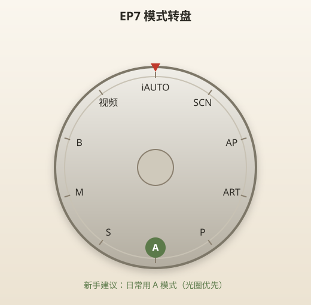
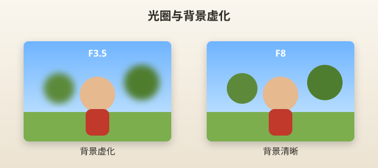
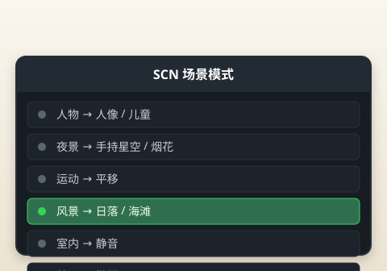
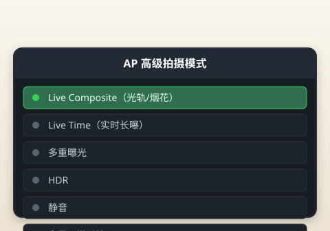

# 模式转盘详解

> 本章目标：搞懂 EP7 模式转盘上每一个档位，知道**什么时候用哪个**。

---

## 模式转盘长什么样？

EP7 模式转盘在机身**右上方**（快门附近），共 10 个档位：

```
                    [热靴]
         ┌─── iAUTO ───┐
    SCN ─┤               ├─ AP
    ART ─┤   模式转盘    ├─ P
         │               │
    视频 ─┤               ├─ A
     B  ─┤               ├─ S
         └─── M ─────────┘
```



> 📷 **建议图片**：模式转盘俯拍，每个档位清晰可见并标注名称。

---

## 新手推荐优先级

| 模式 | 推荐指数 | 第一周 | 第一个月 |
|------|---------|--------|---------|
| **A** 光圈优先 | ⭐⭐⭐⭐⭐ | ✅ 主力 | ✅ 主力 |
| **iAUTO** 全自动 | ⭐⭐⭐⭐ | ✅ 过渡 | 少用 |
| **SCN** 场景 | ⭐⭐⭐⭐ | ✅ 特定场景 | ✅ |
| **P** 程序自动 | ⭐⭐⭐ | 了解即可 | 备用 |
| **ART** 艺术滤镜 | ⭐⭐⭐ | 玩创意 | ✅ |
| **S** 快门优先 | ⭐⭐ | 先不碰 | 运动场景 |
| **AP** 高级拍摄 | ⭐⭐ | 先不碰 | 烟花/光轨 |
| **M** 全手动 | ⭐ | 先不碰 | 进阶 |
| **B**  B门/长曝光 | ⭐ | 先不碰 | 配合夜景章 |
| **视频** | ⭐⭐ | 按需 | 按需 |

**一句话建议**：第一个月把 **A 模式** 用熟，比学遍所有模式更有用。

---

## iAUTO（全自动）

### 是什么？

相机替你做所有决定：光圈、快门、ISO、是否闪光——像手机「自动模式」。

### 工作原理

测光 → 识别场景 → 自动组合参数 → 你只管按快门。

EP7 的 iAUTO 还有 **Live Guide（实时指引）**，可以用滑动条调整「背景虚化」「亮度」「色温」——比纯自动友好。

### 推荐指数：⭐⭐⭐⭐（入门第一天）

| 优点 | 缺点 |
|------|------|
| 零思考，出片率高 | 很多参数改不了 |
| Live Guide 直观 | 学不到曝光逻辑 |
| 适合给家人随手拍 | 复杂光线可能误判 |

### 推荐场景

- 第一天试机
- 把相机交给完全不会用的朋友
- 来不及设置的抓拍瞬间

### 推荐参数

无需设置——全自动。

### 常见错误

| 错误 | 后果 |
|------|------|
| 长期只用 iAUTO | 永远学不会 A 模式 |
| 暗光强制闪光 | 人脸油亮、背景黑——可改 Live Guide 降闪光 influence |
| 大太阳下看不清屏幕还硬拍 | 构图不准 |

### 实拍案例

> 家庭聚餐：iAUTO + Live Guide 把「背景虚化」滑一点 → 拍餐桌菜和人，成功率最高。

**何时毕业离开 iAUTO？** 当你能独立用 A 模式拍 50 张满意照片时。

---

## P（程序自动）

### 是什么？

相机选光圈+快门组合，但你可以换组合（程序线），也能调 ISO、曝光补偿。

### 工作原理

相机给出「均衡」的曝光组合；转前拨轮可切换同等曝光的不同快门/光圈配搭。

### 推荐指数：⭐⭐⭐

| 优点 | 缺点 |
|------|------|
| 比 iAUTO 自由 | 不如 A 模式直观 |
| 不用管光圈快门 | 新手仍不知背景虚实谁控制 |
| 适合快速抓拍 | 和 A 模式功能重叠 |

### 推荐场景

- 你已经会 A 模式，想少操心一点
- 街头快拍，来不及想光圈

### 推荐参数

```
ISO：AUTO（上限 3200）
曝光补偿：0
```

### 常见错误

| 错误 | 说明 |
|------|------|
| 以为 P = 专业 | P = Program，不是 Professional |
| 和 A 模式混用没区别 | 人像用 A 更可控 |

### 实拍案例

> 逛街随手拍 storefront：P 模式，走哪拍哪，曝光补偿 +0.3 让画面稍亮。

**新手建议**：知道 P 存在即可，**主力仍用 A**。

---

## A（光圈优先）—— 新手最该用的模式

### 是什么？

**你定光圈，相机自动算快门。**

### 工作原理

```
你选 F 值 → 相机测光 → 自动匹配快门速度 → 正确曝光
```

光圈越小（F 数字越大）→ 进光少 → 快门越慢 → 背景更清晰  
光圈越大（F 数字越小）→ 进光多 → 快门越快 → 背景更虚化

### 推荐指数：⭐⭐⭐⭐⭐

| 优点 | 缺点 |
|------|------|
| 直接控制背景虚化 | 极暗时光圈最大仍可能慢快门 |
| 相机帮你算快门 | 大光圈+长焦仍可能虚焦浅 |
| 专业摄影师日常模式 | 需要理解 F 值含义 |

### 推荐场景

**几乎所有日常拍摄**：人像、美食、旅行、静物、街拍。

### 推荐参数

| 镜头 | 光圈 | ISO | 说明 |
|------|------|-----|------|
| 14-42 @ 14mm | F3.5～F5.6 | AUTO | 风景、环境人像 |
| 14-42 @ 25mm | F4～F5.6 | AUTO | 美食、半身人像 |
| 14-42 @ 42mm | F5.6 | AUTO | 轻度压缩人像 |
| 40-150 @ 150mm | F5.6 | AUTO～1600 | 远景、动物园 |

**怎么调光圈？** A 模式下转**后拨轮**（拇指下方小拨轮）。

### 常见错误

| 错误 | 后果 | 解决 |
|------|------|------|
| F 值越大越「高级」 | F11 室内快门太慢糊片 | 室内 F4～5.6 |
| 一直 F3.5 | 景深太浅，对焦不准就糊 | 多人合影 F5.6+ |
| 不看快门速度 | 1/10 秒手持必糊 | 低于 1/60 提高 ISO 或开大光圈 |
| 背景不虚就怪相机 | 套头+F5.6+离主体远 | 靠近主体、拉长焦段 |

### 实拍案例

| 场景 | 设置 |
|------|------|
| 咖啡馆人像 | A, F4, ISO AUTO, 42mm 端 |
| 餐桌美食 | A, F5.6, 俯拍, 14mm |
| 旅行合影 | A, F5.6～F8, 14mm, 对焦中间人 |



> 📷 **建议图片**：同一场景 F3.5 vs F8 背景虚化对比（各一张）。

---

## S（快门优先）

### 是什么？

**你定快门速度，相机自动算光圈。**

### 工作原理

```
你选 1/500 → 相机自动选 F 值 → 曝光正确
```

### 推荐指数：⭐⭐（第一个月后）

| 优点 | 缺点 |
|------|------|
| 凝固运动 | 新手不直观 |
| 拍流水可慢门 | 光圈可能到极限仍过曝/欠曝 |

### 推荐场景

- 跑步、踢球（1/500～1/1000）
- 瀑布丝滑（1/4～1/15 + 三脚架）
- 车辆 Panning（SCN 也有）

### 推荐参数

| 场景 | 快门 |
|------|------|
| 走路的人 | 1/125 |
| 跑步/宠物 | 1/500 |
| 体育运动 | 1/1000 |
| 手持安全下限 | ≥ 1/焦距等效（如 150mm → 1/300） |

**怎么调？** S 模式下转**前拨轮**（快门环）。

### 常见错误

| 错误 | 后果 |
|------|------|
| 室内 S 模式 1/1000 | 光圈开最大仍欠曝 |
| 快门太慢 | 运动模糊 |

### 实拍案例

> 小孩在公园跑：S, 1/640, ISO AUTO, 14-42 @ 25mm, C-AF 连拍。

---

## M（全手动）

### 是什么？

光圈、快门、ISO 全部你说了算。相机只显示曝光指示（欠曝/过曝）。

### 推荐指数：⭐（进阶）

| 优点 | 缺点 |
|------|------|
| 完全控制 | 学习曲线陡 |
| 棚拍、闪光灯 | 新手极易拍废 |
| 理解曝光原理 | 速度慢 |

### 推荐场景

- 使用外接闪光灯
- 固定参数拍延时序列
- 你已经完全理解曝光三要素

### 推荐参数

第一个月：**不要用 M 模式**。用 A 模式 + 曝光补偿达到 90% 效果。

### 常见错误

| 错误 | 说明 |
|------|------|
| 「专业就必须 M」 | 很多专业摄影师日常用 A |
| 忘记看曝光指示 | 全黑或全白 |

### EP7 的 M 模式便利之处

双拨轮：一个调快门，一个调光圈——比很多相机友好。

---

## SCN（场景模式）

### 是什么？

22 种预设场景，相机自动优化参数。分两级选择：

**第一级（大类）** → **第二级（具体场景）**

| 大类 | 包含场景 |
|------|---------|
| 人物 | 人像、e-人像、人像+风景、人像+夜景、儿童 |
| 夜景 | 夜景、人像+夜景、手持星空、烟花、光轨 |
| 运动 | 运动、儿童、平移 |
| 风景 | 风景、日落、海滩&雪景、全景、逆光 HDR |
| 室内 | 烛光、静音、人像、逆光 HDR |
| 特写 | 微距、自然微距、文档、多焦点拍摄 |



> 📷 **建议图片**：SCN 模式两级选择菜单截图。

### 推荐指数：⭐⭐⭐⭐

| 优点 | 缺点 |
|------|------|
| 针对性优化 | 参数不透明 |
| 手持星空等「一键」 | 不如 A 模式灵活 |
| 新手成功率极高 | 依赖场景选对 |

### 最实用的 5 个 SCN

| 场景 | 何时用 |
|------|--------|
| **人像** | 比 iAUTO 肤色更好 |
| **风景** | 旅行远景，饱和稍增 |
| **儿童** | 对焦+快门偏向凝固 |
| **手持星空** | 星空入门（配合三脚架更好） |
| **静音** | 博物馆、演出 |

### 推荐参数

选 SCN 后一般无需再调。可微调曝光补偿。

### 常见错误

| 错误 | 后果 |
|------|------|
| 场景选错 | 运动模式拍静物——快门太快浪费 |
| 手持星空不用三脚架 | 仍可能糊 |
| 所有情况都用 SCN | 学不到 A 模式 |

### 实拍案例

> 日落海滩：SCN → 风景 → 日落，曝光补偿 -0.3 防止太阳过曝。

---

## ART（艺术滤镜）

### 是什么？

16 种机内滤镜，**拍摄时实时预览**，直出创意效果。

| 滤镜 | 风格 |
|------|------|
| 流行艺术 | 高饱和 |
| 柔焦 | 梦幻朦胧 |
| 颗粒胶片 | 复古 |
| 针孔 | 暗角 LOFI |
| 戏剧 tone | 高反差黑白 |
| 部分色彩 | 留一色其余黑白 |
| … | 共 16 种 |

### 推荐指数：⭐⭐⭐（玩创意）

| 优点 | 缺点 |
|------|------|
| 免后期 | 不可 RAW 回退（JPEG 滤镜） |
| 社交直出 | 容易「滤镜感」过重 |
| 可 Fine Tune 强度 | 拍错无法撤销风格 |

### 推荐场景

- 街拍复古风
- 旅行纪念「有风格」的照片
- Instagram 直发

### 推荐参数

选滤镜 → 屏幕上下滑调整强度 → 建议 **50%～70%**，别拉满。

### 常见错误

| 错误 | 说明 |
|------|------|
| 重要场合全开 ART | 无法恢复普通色彩 |
| 强度 100% | 假、腻 |

### 实拍案例

> 老城区街拍：ART → 颗粒胶片，强度 60%，14-42 @ 17mm。

---

## AP（高级拍摄模式）

### 是什么？

把高级功能集中到模式转盘，不用深逛菜单：

| AP 子模式 | 用途 |
|----------|------|
| Live Composite | 烟花、光轨、星轨叠加 |
| Live Time | 实时看长曝光效果 |
| 多重曝光 | 两次曝光合成一张 |
| HDR | 高动态范围 |
| 静音 | 电子快门无声 |
| 全景 | 横向接片 |
| 梯形校正 | 拍建筑防倒 |
| AE 包围 | 连拍不同曝光 |
| 对焦包围 | 微距景深合成 |



> 📷 **建议图片**：AP 模式列表截图。

### 推荐指数：⭐⭐（第二个月）

| 优点 | 缺点 |
|------|------|
| 烟花/光轨神器 | 学习成本 |
| Live Composite 可预览 | 设置步骤多 |

### 推荐场景

- **Live Composite**：烟花、光绘
- **全景**：大场景
- **静音**：需要绝对安静的场合

### 常见错误

| 错误 | 后果 |
|------|------|
| 不读说明直接用 Live Composite | 全黑或全白 |
| 手持 Live Time 长曝光 | 糊 |

**第一个月**：知道 AP 存在，**夜景章节再学 Live Composite**。

---

## B（B 门 / 时间 / Live Composite）

### 是什么？

B 模式包含三种长曝光：

| 子模式 | 操作 |
|--------|------|
| BULB | 按住快门多久，曝光多久 |
| TIME | 按一次开始，再按一次结束 |
| LIVE COMP | 累积光轨，背景亮度不变 |

### 推荐指数：⭐（配合三脚架）

详见 [10-夜景.md](10-夜景.md)。

---

## 视频模式

### 是什么？

模式转盘转到摄像机图标，拍摄 MOV 视频。

| 子模式 | 规格 |
|--------|------|
| 4K | 3840×2160, 30/25/24p |
| 标准 | 1080p 多种帧率 |
| 高速 | 慢动作（无声音） |

### 新手建议

- 日常 1080p 60fps 足够
- 4K 裁切大、文件大
- 无麦克风接口——环境声收录有限

---

## 模式对照速查表

| 我想… | 用哪个模式 |
|-------|-----------|
| 完全不想动脑 | iAUTO |
| 日常 90% 拍摄 | **A** |
| 拍跑步的人 | S 或 SCN 运动 |
| 拍日落 | SCN 日落 或 A |
| 创意直出 | ART |
| 烟花 | AP → Live Composite |
| 学曝光原理 | M（进阶） |
| 录 Vlog | 视频 → 1080p |

---

## 实战 walkthrough：A 模式「光圈三连」分步练习（15 分钟）

这是全书最重要的一次练习——用同一主体、只改光圈，亲眼看懂 A 模式在控制什么。

### 准备

```
主体：一个立体小物（玩偶、瓶子），放桌面
背景：身后 1.5m 有杂物（书架、窗）
镜头：14-42 @ 42mm（长端虚化最明显）
模式：A     ISO：AUTO     对焦：单点对主体
距离：靠近主体约 0.5m
```

### 分步拍摄

```
第 1 张｜后拨轮把光圈转到 F3.5（最大）
        → 拍摄 → 回放放大看背景
第 2 张｜光圈转到 F5.6
        → 同机位同构图再拍
第 3 张｜光圈转到 F8
        → 再拍一张
```

### 观察与结论

| 光圈 | 背景 | 相机自动给的快门（大概） |
|------|------|------------------------|
| F3.5 | 最虚 | 较快 |
| F5.6 | 中等 | 中 |
| F8 | 较清晰 | 较慢 |

> 🔑 **你会明白**：光圈越大（F 数越小）→ 背景越虚、快门越快。这就是 A 模式给你的**唯一但最有用**的控制权。

### 进阶：加一次「快门观察」

回放每张按 INFO 看快门速度，记录下来。你会发现：**F 变大 → 快门变慢**。当快门低于 1/60，就要警惕手抖糊片（开大光圈或提 ISO）。

---

## 场景 → 模式速选（分步决策）

拿起相机先问自己三句话：

```
1) 要不要控制背景虚化？  要 → A 模式
2) 主体在快速移动吗？    是 → S 模式 或 SCN 运动
3) 完全没时间想？        是 → iAUTO
```

| 场景 | 首选 | 关键参数 |
|------|------|---------|
| 咖啡馆人像 | A | 42mm F4，对眼睛 |
| 跑动小孩 | S / SCN儿童 | 1/500，连拍 |
| 日落 | SCN日落 / A | F8，-0.3EV |
| 烟花 | AP LiveComp | F8 ISO200 三脚架 |
| 随手抓拍 | iAUTO | 无 |

---

## 本章重点回顾

- **A 模式是新手最好的朋友**：你控光圈，相机控快门
- iAUTO 和 SCN 帮你过渡，但别一直停留
- ART 玩创意，重要场合用普通模式
- AP / B / M 是第二个月的内容
- 后拨轮（A 模式）= 光圈；前拨轮（S 模式）= 快门

## 常见误区

| 误区 | 真相 |
|------|------|
| 模式越多越好要全试 | 精通 A 比浅尝辄止强 |
| SCN 比 A 专业 | SCN 是自动 preset，A 更可控 |
| M 模式才专业 | A 是专业摄影师最常用模式之一 |
| 艺术滤镜可以后期加 | 有，但机内实时预览更好玩 |

## 拍摄练习

1. **同一主体用 4 种模式拍**：iAUTO、A(F5.6)、SCN人像、ART 颗粒胶片——对比
2. **A 模式光圈练习**：F3.5 / F5.6 / F8 各拍 5 张，观察背景变化
3. **SCN 打卡**：人像、风景、儿童各 5 张
4. **记录快门速度**：A 模式下拍 10 张，回放看 EXIF 快门，理解相机如何自动匹配
5. **毕业测试**：连续 30 张全部用 A 模式，至少 25 张满意

下一章：[05-14-42EZ镜头.md](05-14-42EZ镜头.md)
