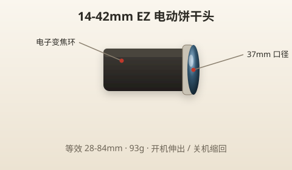
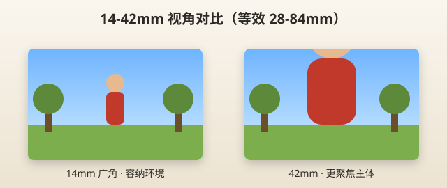

# 14-42mm EZ 镜头使用指南

> 本章目标：把「挂机饼干头」用熟——知道每个焦段拍什么、怎么拍成功率最高。

---

## 镜头一览

| 项目 | 规格 |
|------|------|
| 全称 | M.Zuiko Digital ED 14-42mm F3.5-5.6 EZ |
| 类型 | 电动变焦标准变焦（Pancake 饼干） |
| 焦段 | 14～42mm |
| 等效焦段 | **28～84mm**（×2） |
| 最大光圈 | F3.5（广角端）～ F5.6（长端） |
| 最近对焦 | **0.2m**（20 厘米） |
| 重量 | 约 93g |
| 滤镜口径 | 37mm |
| 特点 | 电动伸缩、关机自动收回、静音 AF |



> 📷 **建议图片**：镜头伸出和收回两种状态对比；标注变焦环位置。

---

## 等效焦段速查

M4/3 乘 2，对应手机/全画幅习惯的视角：

| 变焦位置 | 实际 mm | 等效 mm | 视角感受 | 手机类比 |
|---------|---------|---------|---------|---------|
| 最广 | 14 | 28 | 广角，容纳环境 | 手机 0.5x～1x |
| 中间 | 25 | 50 | 标准，接近人眼 | 手机 1x |
| 最长 | 42 | 84 | 中焦，轻度压缩 | 手机 2x 左右 |

```
14mm ────────── 25mm ────────── 42mm
 广              标准              中焦
 风景            日常              人像半身
 建筑            美食              细节
```



> 📷 **建议图片**：同一位置 14mm / 25mm / 42mm 三张对比图。

---

## 电动变焦：和别的镜头不一样

14-42 EZ 的变焦环是**电子**的：

| 行为 | 说明 |
|------|------|
| 开机 | 镜头自动**伸出**至工作位置，轻微马达声 |
| 关机 | 镜头自动**收回**，变扁便于携带 |
| 变焦 | 转变焦环，匀速电子变焦，不是机械阻尼 |

> ⚠️ **注意**
> - 关机后镜头缩回——**不是故障**
> - 变焦时**不要**用手堵镜头伸缩
> - 没有「变焦锁定」键，放包里已收回即可

> 💡 **小技巧**：拍视频时电动变焦非常顺滑，比手动拧更稳。

---

## 最佳光圈与锐度

| 焦段 | 最佳画质光圈 | 日常推荐 | 虚化能力 |
|------|-------------|---------|---------|
| 14mm | F5.6～F8 | F5.6 | 弱（广角+小光圈） |
| 25mm | F4～F5.6 | F4～F5.6 | 中等 |
| 42mm | F5.6 | F5.6 | 套头里最好 |

**锐度**：中心 F5.6～F8 最锐；F3.5 广角端也够用，别迷信「必须 F8」。

**虚化**：套头+ M4/3 别期待「刀锐奶化」。要明显虚化：**42mm 端 + F5.6 + 主体离背景远 + 靠近主体**。

---

## 适合拍什么？

| 场景 | 推荐焦段 | 模式 | 光圈 | 说明 |
|------|---------|------|------|------|
| **旅行合影** | 14～17mm | A | F5.6～F8 | 容纳多人+背景 |
| **街拍** | 17～25mm | A | F5.6 | 标准视角，低调 |
| **美食** | 14～25mm | A | F5.6 | 0.2m 近摄够俯拍 |
| **咖啡店内景** | 14mm | A | F4 | 空间小要广角 |
| **半身人像** | 35～42mm | A / SCN人像 | F4～F5.6 | 对焦眼睛 |
| **建筑外观** | 14mm | A | F8 | 注意垂直线条 |
| **桌面静物** | 25～42mm | A | F5.6 | 三脚架或高 ISO |
| **Vlog 自拍** | 14mm | 视频 | F5.6 | 翻转屏+广角 |

---

## 不适合拍什么？

| 场景 | 为什么 | 怎么办 |
|------|--------|--------|
| 远处动物/舞台 | 42mm 等效 84mm 不够远 | 换 **40-150** |
| 演唱会后排 | 同上 | 换 40-150 |
| 月亮特写 | 84mm 等效太小 | 40-150 @ 150 + 三脚架 |
| 极致背景虚化 | F5.6 套头限制 | 接受或日后买 F1.8 定焦 |
| 快速运动远距离 | 焦段不够 | 换 40-150 |
| 暗光无防抖场景 | 光圈最大 F3.5 | 靠 EP7 机身防抖；开 ISO |

---

## 与 40-150 的搭配策略

```
出门默认：14-42 装在机身上
需要「拉近」时：找地方关机换 40-150
```

| 一天行程示例 | 镜头选择 |
|-------------|---------|
| 城市逛街+咖啡馆 | 只带 14-42 |
| 动物园 | 14-42 进门，换 40-150 进园区 |
| 旅行混合 | 14-42 挂机，40-150 放包侧袋 |
| 纯远景（登山观云） | 直接装 40-150 |

**换镜头信号**：你发现自己走很近还是拍不大 → 该换长焦了。

---

## 场景实例详解

### 旅游

```
镜头：14-42 @ 14～17mm
模式：A
光圈：F5.6～F8
ISO：AUTO
对焦：单点，对中间人物
```

合影时 F8 让前后排都清晰；单人纪念照 F5.6 即可。

### 街拍

```
镜头：14-42 @ 17～25mm
模式：A
光圈：F5.6
快门：相机自动，确保 ≥1/125
```

广角街拍融入环境，不要怼脸。提前半按快门预对焦。

### 美食

```
镜头：14-42 @ 14～25mm
模式：A
光圈：F5.6
角度：45° 斜俯或 90° 正俯
最近距离：约 20cm，别靠太近挡光
```

餐厅暗 → ISO 自动升；用曝光补偿 +0.3～+0.7 让菜更 appetizing。

### 建筑

```
镜头：14-42 @ 14mm
模式：A
光圈：F8
注意：保持水平，可用网格线
```

14mm 边缘畸变明显——拍建筑尽量让相机水平，后期可梯形校正（AP 模式）。

### 人像

```
镜头：14-42 @ 35～42mm（等效 70～84mm）
模式：A 或 SCN 人像
光圈：F4～F5.6
对焦：眼睛
距离：1.5～3m
```

**别用 14mm 拍人脸特写**——广角畸变，鼻子变大。

### 儿童（室内）

```
镜头：14-42 @ 17～25mm
模式：A 或 SCN 儿童
光圈：F4
ISO：AUTO（可能 800～1600）
快门：尽量 ≥1/200
```

儿童动——用连拍（H 连拍），多拍选最好的。

### 宠物（室内）

同儿童，对焦眼睛，连拍。14-42 足够室内距离。

### 体育 / 演唱会

14-42 **不合适**。见 [06-40-150R镜头.md](06-40-150R镜头.md)。

### 月亮

14-42 只能拍「大月亮小点」。要月亮占画面 → 40-150 @ 150mm + 三脚架 + M 或 S 模式。

---

## 操作要点

### 安装与拆卸

与 [01-第一次拿到EP7.md](01-第一次拿到EP7.md) 相同：**关机 → 白点对齐 → 锁紧**。

### 遮光罩

EZ 通常无标配遮光罩。强光逆光可用手或帽子挡一下，或买选配遮光罩。

### 保护

- 可选自动开合镜头盖（LC-37C）
- 放包时用机身盖或镜头已收回状态

---

## 新手常见错误

| 错误 | 现象 | 解决 |
|------|------|------|
| 14mm 拍大头照 | 脸变形 | 改 35mm+ 或退远 |
| 美食离太近 | 对焦失败 | 退到 20cm 外 |
| 室内 F8 | 快门太慢糊 | 改 F4，ISO 交给 AUTO |
| 忘记镜头会缩回 | 以为坏了 | 开机即伸出 |
| 不擦镜头 | 油膜灰雾 | 气吹+镜头布 |

---

## 实战 walkthrough：一支 14-42 拍一条街（15 分钟脚本）

只带这一支镜头出门，按脚本走一遍，把「一个焦段拍什么」变成肌肉记忆。全程 **A 模式**。

```
机位 1｜街道全景（14mm, F8）
  → 站路口，等一个行人入画，对焦中景
  → 目的：练广角容纳环境

机位 2｜店招 / 橱窗（25mm, F5.6）
  → 平视拍店面，网格线保持水平
  → 目的：练标准视角、水平构图

机位 3｜美食 / 桌面（25mm, F5.6, +0.3EV）
  → 45° 斜俯，距离约 25cm 别挡光
  → 目的：练近摄与曝光补偿

机位 4｜行人半身（42mm, F5.6）
  → 长端 + 靠近，背景拉虚
  → 目的：练中焦人像、虚化

机位 5｜细节特写（42mm, F5.6, 近对焦）
  → 门牌、把手、花——推到最近对焦距离
  → 目的：练最近对焦与选点
```

### 拍完自检

| 机位 | 合格标准 |
|------|---------|
| 全景 | 水平、主体不居正中 |
| 店招 | 垂直线正、无过曝 |
| 美食 | 亮、清晰、不挡光 |
| 半身 | 眼睛清、背景有虚化 |
| 特写 | 对上焦、主体突出 |

> 🎯 **目标**：5 个机位各拍 2～3 张，回家选出 5 张「一条街的故事」。练完你就懂 14/25/42 各拍什么。

---

## 焦段决策速查（站在原地先想）

```
拍不下 / 想要环境感 → 往 14mm 转
接近人眼、最百搭     → 25mm
想要虚化 / 人像半身  → 42mm
还是拍不大（远物）   → 该换 40-150 了
```

---

## 本章重点回顾

- 14-42 EZ = 日常挂机，等效 **28～84mm**
- **14mm** 风景合影，**25mm** 标准日常，**42mm** 人像半身
- 电动变焦，**开关机自动伸缩**
- 最佳实用光圈 **F4～F5.6**，别一味 F8
- 需要拉近 → 换 40-150

## 常见误区

| 误区 | 真相 |
|------|------|
| 「套机头画质差」 | 阳光 F5.6 完全够用 |
| 「广角能拍一切人像」 | 14mm 拍脸会畸变 |
| 「F3.5 应该一直开」 | 室内可以，合影要 F5.6+ |
| 「电动变焦是缺点」 | 视频和便携是优点 |

## 拍摄练习

1. **焦段三连**：同一主体 14 / 25 / 42 各 1 张
2. **美食五张**：不同角度、不同焦段
3. **人像对比**：14mm vs 42mm 拍同一人
4. **最近对焦**：找小物件，推到 20cm 试最小距离
5. **一天只用 14-42**：出门不带 40-150，强迫熟悉标准焦段

下一章：[06-40-150R镜头.md](06-40-150R镜头.md)
