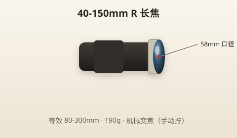
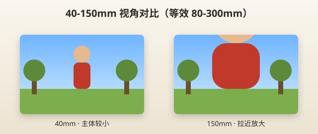

# 40-150mm R 镜头使用指南

> 本章目标：知道长焦镜头何时上场、怎么拍远、怎么避免糊片和噪点。

---

## 镜头一览

| 项目 | 规格 |
|------|------|
| 全称 | M.Zuiko Digital ED 40-150mm F4.0-5.6 R |
| 类型 | 轻量 tele 变焦 |
| 焦段 | 40～150mm |
| 等效焦段 | **80～300mm** |
| 最大光圈 | F4.0（40mm）～ F5.6（150mm） |
| 最近对焦 | **0.9m**（90 厘米） |
| 重量 | 约 190g |
| 滤镜口径 | 58mm |
| 特点 | MSC 静音对焦、机械变焦（拧动） |



> 📷 **建议图片**：镜头全长伸出状态；与 14-42 并排对比大小。

---

## 等效焦段：为什么需要它？

14-42 最长等效 84mm。40-150 补上 **80～300mm**：

```
14-42:  [========28──────84mm========]
40-150:                    [====80────300mm====]
```

| 位置 | 等效 | 感受 |
|------|------|------|
| 40mm | 80mm | 人像特写、隔离背景 |
| 100mm | 200mm | 动物园中距离 |
| 150mm | 300mm | 远景、舞台、鸟 |



> 📷 **建议图片**：同一远景 40mm 与 150mm 对比。

---

## 最佳光圈与锐度

| 焦段 | 推荐光圈 | 说明 |
|------|---------|------|
| 40～70mm | F5.6 | 日常 |
| 100～150mm | F5.6～F8 | 长端稍收一点更锐 |
| 最大 F4 | 40mm 端 | 略暗环境可用 |

**虚化**：150mm + F5.6 + 主体离背景远 → 背景明显比 14-42 更柔。

**锐度**：入门长焦，F5.6～F8 完全满足社交分享和 A4 打印。

---

## 适合拍什么？

| 场景 | 推荐焦段 | 模式 | 要点 |
|------|---------|------|------|
| **动物园** | 100～150mm | A / SCN | 玻璃反光注意角度 |
| **旅行远景** | 70～150mm | A | 雪山、塔、对岸建筑 |
| **演唱会/舞台** | 100～150mm | A, ISO↑ | 光线暗，别期望顶级画质 |
| **体育（看台）** | 100～150mm | S, 1/500+ | 连拍 |
| **人像特写** | 70～100mm | A, F5.6 | 0.9m 外 |
| **街拍压缩** | 80～120mm | A | 长焦压缩透视 |
| **月亮（入门）** | 150mm | M/S + 三脚架 | 见夜景章 |
| **宠物（室外）** | 70～120mm | A / C-AF | 距离够再拍 |

---

## 不适合拍什么？

| 场景 | 原因 | 替代 |
|------|------|------|
| 美食、桌面 | 最近 0.9m，无法俯拍近距 | 14-42 |
| 室内合影 | 空间不够退 | 14-42 @ 14mm |
| 餐厅、小房间 | 退到墙还拍不全 | 14-42 |
| 暗光手持长焦 | 150mm 需 1/300+ 快门 | 提 ISO 或三脚架 |
| 专业野生动物 | 300mm 等效仍嫌短 | 更长焦镜头（进阶） |

---

## 何时换镜头？

出现以下情况，**关机换 40-150**：

- [ ] 主体在 10 米外，14-42 拍出来太小
- [ ] 去动物园、看演出、登山观景
- [ ] 想拍背景强烈虚化的半身人像（户外）
- [ ] 想压缩街道透视（长焦街拍）

**不必换**：

- 室内、餐厅、普通合影
- 主体就在 1～3 米内

### 换镜头标准流程

```
1. 关机
2. 按镜头释放钮，逆时针卸 14-42
3. 立刻装前后盖（14-42 会缩回）
4. 40-150 白点对白点，锁紧
5. 开机，试拍一张确认
6. 镜头朝地，减少进灰
```


> 📷 **建议图片**：换镜头过程 4 步连拍；或正确持机方向。

> ⚠️ **户外换镜头**：尽量背风、身体挡风、快速完成。有风有沙宁可不换。

---

## 场景实例详解

### 旅游（远景）

```
焦段：80～120mm
模式：A
光圈：F5.6～F8
ISO：AUTO
```

拍对岸的城堡、山顶的塔——14-42 拍出来只有一个小点，150mm 端能填满画面。

### 动物园

```
焦段：100～150mm
模式：A 或 S（动物动时用 S 1/500）
光圈：F5.6
ISO：400～3200（室内馆）
对焦：单点，对动物眼睛
```

**技巧**：找干净背景（虚化遮笼子）；玻璃展柜垂直贴屏减少反光。

### 街拍（长焦）

```
焦段：等效 80～120mm
模式：A
光圈：F5.6
```

长焦街拍更「隐蔽」，压缩街道层次感。站在街角拍对面行人。

### 建筑（局部）

```
焦段：80～100mm
模式：A
光圈：F8
```

拍建筑细节、窗户排列——不是整栋，是局部几何。

### 人像（户外半身/特写）

```
焦段：70～100mm（等效 140～200mm）
模式：A 或 SCN 人像
光圈：F5.6
距离：2～5m
```

长焦人像 flattering，畸变小。**最近 0.9m**，别靠太近对不上焦。

### 演唱会

```
焦段：150mm
模式：A
光圈：F5.6（固定）
ISO：1600～6400
快门：≥1/125，最好 1/250
```

**现实预期**：EP7 + 40-150 在暗场演唱会只能「记录氛围」，别和专业 70200 F2.8 比。开高 ISO 接受噪点。

### 体育

```
焦段：100～150mm
模式：S
快门：1/500～1/1000
ISO：AUTO
驱动：H 连拍
对焦：C-AF（连续）
```

看台距离远——150mm 等效 300mm 是上限，仍可能嫌小。

### 月亮（入门）

```
焦段：150mm
模式：M 或 S
光圈：F8
快门：约 1/125～1/250（看亮度微调）
ISO：200～400
支撑：三脚架必须
```

150mm 月亮占画面仍不大，但能拍出环形山细节。想要更大 → 更长焦或裁切。

### 宠物（室外）

```
焦段：70～120mm
模式：A，连拍
快门：≥1/500
```

长焦让宠物自然玩耍，你在远处拍，不打扰。

### 儿童（室外活动）

同体育，连拍 + 快快门。比 14-42 更适合运动场边家长席。

### 烟花

40-150 **不是首选**。烟花用广角 14-42 或三脚架固定机位。长焦难对准天空爆炸范围。

---

## 长焦手持技巧

长焦放大抖动。安全快门经验公式：

```
安全快门 ≈ 1 / 等效焦距

150mm → 等效 300mm → 建议 ≥ 1/300 秒
```

EP7 有 4.5 档防抖，可放宽约 2～3 档，但**新手仍建议 ≥ 1/250**。

| 快门太慢 | 现象 | 解决 |
|---------|------|------|
| 1/60 @ 150mm | 大概率糊 | ISO 提高或 F4 开大 |
| 风大 | 镜头抖 | 找支撑、连拍选最锐 |

---

## 与 14-42 的一天搭配示例

| 时间 | 镜头 | 拍什么 |
|------|------|--------|
| 上午 city walk | 14-42 | 早餐、街道、合影 |
| 中午 zoo | 换 40-150 | 动物 |
| 下午回酒店 | 换 14-42 | 休息、室内 |
| 傍晚观景台 | 40-150 | 日落远山 |

---

## 实战 walkthrough：动物园半日实拍脚本（分步）

长焦最好的练习场就是动物园——距离远、主体动、常隔玻璃。按脚本走完，长焦就上手了。

### 进门前设置（一次设好）

```
镜头：40-150     模式：A     光圈：F5.6
ISO：AUTO（室内馆临时提上限到 3200）
对焦：单点（对动物眼睛）；动物快速移动切 C-AF + H 连拍
快门底线：≥1/250（150mm 端更要）
```

### 分场景操作

```
场景 1｜室外围栏动物（100～150mm）
  → 找栏杆空隙，光圈 F5.6 让栏杆虚化「消失」
  → 对焦动物眼睛，连拍抓表情

场景 2｜玻璃展柜（爬虫/水族）
  → 镜头前端尽量垂直贴近玻璃，减少反光
  → 关闪光灯！否则玻璃反光一片白
  → ISO 提到 1600～3200，快门≥1/125

场景 3｜奔跑 / 飞禽（150mm）
  → 切 S 模式 1/500～1/1000，或 SCN 运动
  → C-AF 追焦 + H 连拍，拍一串选最锐

场景 4｜干净背景特写（70～100mm）
  → 找天空/绿植做背景，F5.6 虚化
  → 得到「专业感」隔离主体
```

### 常见翻车与救法

| 现象 | 原因 | 救法 |
|------|------|------|
| 全糊 | 快门太慢 | 提 ISO / 开 F4 / 靠支撑 |
| 对到栏杆 | 单点压在栏杆上 | 移点到缝隙、开大光圈 |
| 玻璃反光 | 有闪光 / 角度 | 关闪光、贴玻璃、变角度 |
| 主体太小 | 150mm 仍不够 | 靠近 / 回家裁切 LF |

> 🎯 **目标**：一个半天拍 100+ 张，回家选 10 张清晰、背景干净的。练完你会明白长焦的「快门底线」和「找干净背景」两条铁律。

---

## 长焦手持稳定分步

```
1. 左手托住镜头下方（不是抓机身）
2. 双肘夹紧肋部形成支撑
3. 呼气到一半时屏息按快门
4. 连拍 3 张，选最锐的一张
5. 有栏杆/树干就靠上去当「人肉三脚架」
```

---

## 本章重点回顾

- 40-150 R = **80～300mm 等效**，轻量长焦
- **最近对焦 0.9m**——不能拍美食微距
- 动物园、远景、户外人像、舞台 = 主战场
- 长焦要**快快门**（≥1/250）+ 注意 ISO
- 换镜头务必**关机**，户外防风防尘

## 常见误区

| 误区 | 真相 |
|------|------|
| 「长焦万能」 | 室内、近距离不开 14-42 |
| 「防抖所以 1/30 也能手持 150mm」 | 防抖有极限 |
| 「F5.6 太暗」 | 白天完全够，暗场靠 ISO |
| 「演唱会能拍清楚歌手表情」 | 看台距离+光线限制大 |

## 拍摄练习

1. **换镜头 5 次**：计时，目标 1 分钟内完成
2. **同场景 14-42 vs 40-150**：感受「拉近」差异
3. **150mm 手持测试**：1/60 vs 1/250 各拍 5 张，看糊片率
4. **户外人像**：70～100mm，F5.6，拍 10 张
5. **远景**：找 50m 外建筑，150mm 填满画面

下一章：[07-第一次出去拍照.md](07-第一次出去拍照.md)
