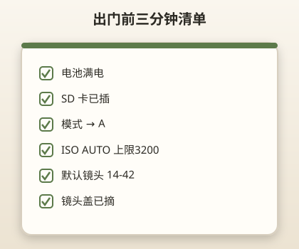
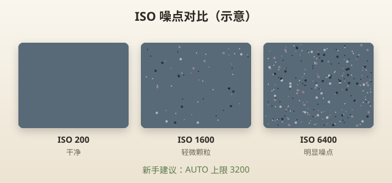
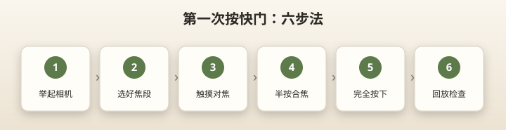

# 第一次出去拍照

> 本章目标：出门前 3 分钟完成设置，带着「配置清单」自信开拍。

---

## 出门前三分钟检查清单

打印或存手机，每次出门过一遍：

```
□ 电池满电（或 ≥80%）
□ SD 卡已插，空间充足
□ 镜头盖已摘
□ 模式转盘 → A
□ ISO → AUTO（上限 3200）
□ 画质 → LF
□ 对焦 → S-AF，单点
□ 防抖 → 开
□ 曝光补偿 → 0
□ 默认镜头 → 14-42 EZ
□ 40-150 放包侧袋（如需）
□ 肩带牢固
```



> 📷 **建议图片**：自制检查清单卡片实物照；或手机备忘录截图。

---

## 第一次出门：推荐路线

**不要第一天就去复杂场景**。建议：

1. **小区或家附近**（30 分钟）
2. **附近公园**（1 小时）
3. **商业街**（第二周）

第一次目标：**拍清楚 30 张**，不是拍「大片」。

---

## 标准配置（复制即用）

### 通用白天配置

```text
模式转盘：A（光圈优先）
光圈：F5.6
ISO：AUTO（上限 3200）
白平衡：AUTO
图片质量：LF（大 JPEG）
对焦模式：S-AF（单次）
AF 区域：单点（可触摸）
驱动模式：单张
防抖：S-IS AUTO
测光：ESP 默认
曝光补偿：0
闪光灯：关（白天）
镜头：14-42 EZ
```

### 为什么这样设？

| 设置 | 理由 |
|------|------|
| A 模式 | 你只管光圈，快门自动 |
| F5.6 | 套头最佳 compromise：画质+景深 |
| ISO AUTO | 光线变化不用你管 |
| 上限 3200 | 控制噪点 |
| S-AF | 静物人像最稳 |
| 闪光关 | 白天闪光没必要 |

---

## 各参数第一次怎么理解

### 模式 → A

见 [04-模式转盘.md](04-模式转盘.md)。出门默认 A，特殊场景再换 SCN。

### ISO → AUTO

相机根据光线自动调节感光度。你只需设**上限 3200**。

| 光线 | 相机大概用 |
|------|-----------|
| 大晴天 | ISO 200 |
| 阴天 | ISO 400～800 |
| 室内 | ISO 800～3200 |



> 📷 **建议图片**：同一场景 ISO 200 / 1600 / 6400 对比（可选后期章内容）。

### 白平衡 → AUTO

第一个月不用改。餐厅偏黄、阴天偏冷——AUTO 大多能处理。

### JPEG → LF

直接出片，手机/电脑能看。不用 RAW。

### 对焦 → S-AF + 单点 + 触摸

半按快门对焦，或点屏幕。对**主体**对焦，不是背景。

### 防抖 → 开

EP7 核心优势，别关。

### 曝光补偿 → 0

| 现象 | 调整 |
|------|------|
| 照片偏暗 | +0.3 ～ +1.0 |
| 照片偏亮、天空死白 | -0.3 ～ -1.0 |

A 模式下转**前拨轮**（快门按钮周围）调曝光补偿。

---

## 第一次按快门：六步法

```
1. 举起相机，屏幕朝向自己
2. 变焦到合适焦段（14-42 转变焦环）
3. 触摸屏幕将对焦框移到主体
4. 半按快门——等对焦框变绿
5. 构图稳定，完全按下快门
6. 回放放大检查是否清晰
```



> 📷 **建议图片**：半按快门对焦 green box 截图。

---

## 按场景微调（仍用 14-42）

| 场景 | 改动 |
|------|------|
| 大合影 | F8，14mm |
| 单人肖像 | F4～F5.6，42mm |
| 树荫下偏暗 | 曝光补偿 +0.7 |
| 逆光人脸黑 | +1.0 或 SCN 逆光 HDR |
| 小孩跑动 | SCN 儿童 或 C-AF 连拍 |

---

## 包里带什么

| 物品 | 必要性 |
|------|--------|
| 充满电的 EP7 + 14-42 | 必须 |
| 40-150（视行程） | 动物园/远景必带 |
| 备用电池 | 强烈建议 |
| 64GB+ SD 卡 | 必须 |
| 气吹 | 建议 |
| 镜头布 | 建议 |
| 小三脚架 | 夜景再带 |

**不必第一天带**：外闪、滤镜、反光板。

---

## 第一次拍摄主题建议

### 练习 1：静物（10 张）

- 小区花、长椅、自己的鞋
- A, F5.6, 25mm
- 练对焦和回放

### 练习 2：风景（10 张）

- 树、天空、小 pond
- A, F8, 14mm
- 练广角构图

### 练习 3：自拍/他拍（10 张）

- 翻转屏自拍 3 张
- 请路人帮你拍 2 张
- SCN 人像 5 张

---

## 拍完回家：5 分钟整理

1. 回放删除明显糊片、闭眼、重复
2. 选 3 张最满意的
3. 看 EXIF：光圈、快门、ISO 各是多少？
4. 记录一个问题：「今天哪张最不满意？为什么？」
5. SD 卡备份到电脑或云盘

---

## 天气与 EP7 注意

EP7 **不防尘防滴**：

| 天气 | 建议 |
|------|------|
| 小雨 | 塑料袋套机，别换镜头 |
| 大太阳 | 找阴影看屏幕，或手遮光 |
| 极冷 | 电池消耗快，揣怀里暖 |
| 沙滩 | 风大别换镜头，防沙 |

---

## 实战 walkthrough：公园 30 张「闯关任务单」

第一次出门别乱拍。按这张任务单走，每关一个明确目标，30 张拍完你就完成了「新手上路」。全程 **A 模式 + F5.6 起步**。

```
关卡 1｜静物 ×6（练对焦）
  · 长椅、花、路牌、自己的鞋
  · 25mm F5.6，点屏对焦，半按变绿再拍
  · 过关标准：6 张主体都清晰

关卡 2｜广角风景 ×6（练构图）
  · 大树、天空、小路
  · 14mm F8，开网格线，地平线放上/下三分线
  · 过关标准：地平线不歪、画面有层次

关卡 3｜曝光补偿 ×6（练明暗控制）
  · 同一树荫场景：0 / +0.7 / -0.7 各两张
  · 前拨轮调 EV，回放对比亮度
  · 过关标准：说得出哪张最合适、为什么

关卡 4｜虚化 ×6（练光圈）
  · 花/朋友，42mm F4，靠近主体、背景拉远
  · 过关标准：背景明显虚

关卡 5｜人 ×6（练综合）
  · 请人帮拍你，或拍同行者半身
  · 42mm F5.6，对眼睛
  · 过关标准：眼睛清、构图舒服
```

### 回家结算

```
1. 删掉糊片、闭眼、重复
2. 每关选 1 张最好的（共 5 张）
3. 看这 5 张的 EXIF：快门都高于 1/60 吗？
4. 记 1 条今天最大的问题
```

> 🎯 **过关线**：30 张里至少 20 张清晰、5 张你自己满意，就算通关。

---

## 出门前 3 分钟：分步盲操

把[出门检查清单](#)背成动作流：

```
① 电量看一眼（≥80%）    ② 卡在不在
③ 转盘拨到 A            ④ 按 OK 进 SCP 扫一眼 ISO/AF
⑤ 摘镜头盖             ⑥ 装 14-42、40-150 进包
```

熟练后全程不超过 1 分钟。

---

## 本章重点回顾

- 出门用 **A + F5.6 + ISO AUTO(3200) + S-AF**
- 三分钟 checklist 养成习惯
- 第一次选简单场景，目标 30 张清楚照片
- 曝光补偿是「照片太亮/太暗」的第一调节手段
- 回家删废片、看 EXIF、备份

## 常见误区

| 误区 | 真相 |
|------|------|
| 第一次就去夜景/演唱会 | 挫败感强，先练白天 |
| 带太多配件 | 14-42 + 满电即可出门 |
| 不回放就猛拍 | 100 张糊片不如 10 张清楚 |
| 曝光补偿一直 +2 | 高光会死 |

## 拍摄练习

1. 按 checklist 完整走一遍，计时 3 分钟
2. 小区完成 30 张，至少 25 张清晰
3. 练习曝光补偿：0 / +0.7 / -0.7 同场景对比
4. 用 EXIF 记录：你的「安全快门」大概是多少（手持 42mm）
5. 写 100 字心得：今天最大困难是什么

专题实战：

- 人像 → [08-拍人像.md](08-拍人像.md)
- 风景 → [09-拍风景.md](09-拍风景.md)
- 夜景 → [10-夜景.md](10-夜景.md)
