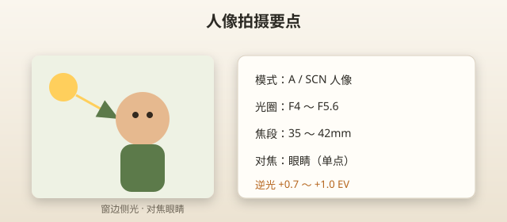
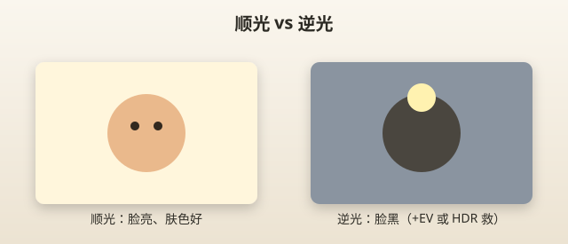
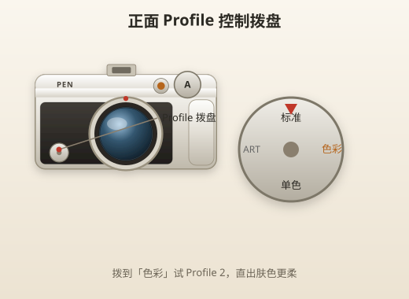

# 拍人像

> 本章目标：给朋友、家人拍出清晰、肤色自然、背景适度虚化的人像照片。

---

## 人像新手一句话配置

```text
模式：A（或 SCN → 人像）
镜头：14-42 @ 35～42mm（半身） / 40-150 @ 70～100mm（户外特写）
光圈：F4～F5.6
ISO：AUTO
对焦：单点，对眼睛
曝光补偿：+0.3（逆光时 +0.7～+1.0）
驱动：单张或低速连拍
```



> 📷 **建议图片**：EP7 拍人像时的机位示意图；对焦在眼睛的屏幕截图。

---

## 镜头选择

| 情况 | 镜头 | 焦段 |
|------|------|------|
| 室内空间有限 | 14-42 | 25～42mm（等效 50～84mm） |
| 户外半身 | 14-42 | 35～42mm |
| 户外特写、虚化更强 | 40-150 | 70～100mm |
| 大合影 | 14-42 | 14～17mm，F8 |

**避免**：14mm 拍单人脸部特写——鼻子变大、边缘拉伸。

---

## 模式选择

| 模式 | 何时用 |
|------|--------|
| **A** | 日常主力，可控虚化 |
| **SCN 人像** | 肤色优化，省心 |
| **SCN e-人像** | 机内轻微磨皮，直出友好 |
| **iAUTO + Live Guide** | 完全新手、交给朋友拍 |

第一个月：**A 模式 F4～F5.6** 足够。

---

## 光圈：背景虚不虚看它

| 光圈 | 效果 | 场景 |
|------|------|------|
| F3.5～F4 | 背景较虚 | 单人、杂背景 |
| F5.6 | 平衡 | 日常半身 |
| F8 | 前后都清晰 | 多人合影 |

**套头虚化有限**——接受它，或：**42mm/长焦 + 靠近主体 + 背景远**。

---

## 对焦：眼睛，永远是眼睛

```
触摸屏幕 → 对焦框移到最近那只眼睛 → 半按快门 → 构图 → 全按
```

| 错误对焦 | 后果 |
|---------|------|
| 对鼻子/脸颊 | 眼睛虚 |
| 对背景 | 人糊 |
| 对头发 | 脸虚 |

开启 **人脸检测**（MENU → AF 菜单）可辅助，但单点选眼睛更准。

---

## 光线：人像成败关键

| 光线 | 效果 | 建议 |
|------|------|------|
| 窗边侧光 | 立体、肤色好 | ⭐ 室内最佳 |
| 阴天 | 柔和、无硬影 | ⭐ 户外最佳 |
| 黄金时刻（日出后/日落前 1h） | 暖、柔 | ⭐⭐⭐ |
| 正午顶光 | 眼窝黑影 | 找阴影或戴帽 |
| 逆光 | 脸黑或剪影 | 曝光补偿 +1.0 或闪光补 |



> 📷 **建议图片**：同一人顺光与逆光对比；逆光 + 曝光补偿后的改善。

### 逆光救脸

```
A, F5.6, 曝光补偿 +0.7～+1.0
或 SCN → 逆光 HDR
或 内置闪光灯补光（功率调低，-1EV 闪光补偿）
```

---

## 构图速成

| 方法 | 做法 |
|------|------|
| 三分法 | 眼睛在上 1/3 线 |
| 留白 | 看向方向留空间 |
| 全身 | 脚别切在关节，留脚踝 |
| 头顶 | 别切头发，上方留一点空 |

开 **3×3 网格线** 辅助。

---

## 机位与距离

| 景别 | 14-42 焦段 | 大约距离 |
|------|-----------|---------|
| 大头 | 42mm | 1～1.5m |
| 半身 | 25～35mm | 1.5～2.5m |
| 全身 | 17～25mm | 3～5m |

---

## 参数速查表

### 室内窗边

```text
镜头：14-42 @ 35mm
模式：A
光圈：F4
ISO：AUTO（通常 400～800）
快门：≥1/60（防抖辅助）
WB：AUTO
曝光补偿：0
```

### 户外阴天

```text
镜头：14-42 @ 42mm 或 40-150 @ 80mm
模式：A
光圈：F5.6
ISO：AUTO（200～400）
曝光补偿：+0.3
```

### 户外逆光

```text
模式：A 或 SCN 逆光 HDR
光圈：F5.6
曝光补偿：+0.7～+1.0
```

### 儿童

```text
模式：SCN 儿童 或 A
镜头：14-42 @ 25mm
光圈：F4
快门：≥1/200
驱动：H 连拍
对焦：C-AF 或 S-AF 预对焦
```

### 宠物

同儿童，对焦眼睛，连拍。室外可用 40-150 远距离抓拍。

---

## 内置闪光灯人像

EP7 有弹出式闪光灯。

| 何时用 | 何时不用 |
|--------|---------|
| 室内暗、人脸黑 | 博物馆、演出 |
| 逆光补脸 | 已有良好自然光 |
| 填闪（白天压阴影） | 拍婴儿眼睛 |

**功率调低**：SCP 或 MENU 闪光补偿 **-0.7～-1.0**，避免油光脸。

---

## 色彩配置文件（进阶玩法）

EP7 正面 **Profile Control 拨盘** 可切换：

| 档位 | 效果 |
|------|------|
| 标准 | 默认 |
| 色彩 Profile | 胶片感、可调饱和 |
| 单色 Profile | 黑白、颗粒 |

拍人像试 **色彩 Profile 2**（类似 Portra）——直出肤色更柔。



> 📷 **建议图片**：Profile 拨盘位置；标准 vs 色彩 Profile 人像对比。

---

## 常见错误

| 错误 | 现象 | 解决 |
|------|------|------|
| 14mm 贴脸拍 | 大鼻子 | 退远或加长焦 |
| 不对眼睛对焦 | 眼虚 | 单点对眼 |
| 逆光不补偿 | 脸黑 | +EV 或 HDR |
| F8 室内 | 糊 | F4 + ISO |
| 闪光满功率 | 油亮 | 降闪光补偿 |
| 不看快门 | 1/15 秒糊 | 提高 ISO |

---

## 实战 walkthrough：窗边人像 10 分钟布光（分步）

不用任何灯，只用一扇窗，就能拍出立体好看的人像。这是新手最该掌握的一套。

### 布置

```
1. 找一扇大窗（白天，不要直射硬阳光）
2. 人侧对窗，让光从侧面 45° 打脸
3. 人离窗约 1～1.5m，别贴着
4. 你站在窗与人之间稍偏，背对窗拍
```

### 拍摄

```
镜头：14-42 @ 35～42mm
模式：A     光圈：F4     ISO：AUTO
对焦：单点，压在「靠窗那只眼睛」
曝光补偿：0，若脸偏暗 +0.3
快门：确认 ≥1/60（低了提 ISO）
```

### 分步微调

```
第 1 张｜侧光 45°，拍半身
  → 观察：脸一侧亮、一侧稍暗 = 立体感（对了）
第 2 张｜让人稍转向窗
  → 脸更亮、阴影更少（更「甜」）
第 3 张｜让人转离窗
  → 阴影更重、更「情绪」
```

> 🔑 **结论**：转动人相对窗的角度 = 控制脸上光影。这比买灯更重要。

### 逆光救脸分步（窗在人身后时）

```
1. 保持 A, F5.6
2. 曝光补偿加到 +0.7 ～ +1.0（脸提亮）
3. 若背景过曝可接受（要脸不要背景）
4. 或改 SCN → 逆光 HDR
5. 仍暗 → 弹内置闪光，闪光补偿 -1EV 补脸
```

---

## 三种景别一次拍全（分步）

同一个人，练「全身→半身→特写」的机位与焦段切换：

```
全身｜17～25mm，退到 3～5m，脚踝以下留空间，别切关节
半身｜25～35mm，1.5～2.5m，腰或胸口构图
特写｜42mm，1～1.5m，对眼睛，头顶留一点空
```

| 景别 | 焦段 | 距离 | 对焦点 |
|------|------|------|--------|
| 全身 | 17-25mm | 3-5m | 面部/身体 |
| 半身 | 25-35mm | 1.5-2.5m | 眼睛 |
| 特写 | 42mm | 1-1.5m | 眼睛 |

> 🎯 **目标**：同一人拍出 3 种景别各 2 张，理解「焦段 + 距离」如何决定景别。

---

## 本章重点回顾

- 人像默认 **A, F4～F5.6, 对焦眼睛**
- 14-42 用 35～42mm，户外特写可 40-150
- 光线 > 器材；窗边、阴天、黄金时刻最好
- 逆光记得 **曝光补偿 +0.7**
- 套头虚化有限，靠焦段+距离弥补

## 常见误区

| 误区 | 真相 |
|------|------|
| 「虚化不够是相机差」 | 套头 F5.6 正常，技巧可改善 |
| 「人像必须大光圈 F1.8」 | F4～F5.6 日常够用 |
| 「e-人像可以救一切」 | 光线和对焦才是根本 |
| 「竖拍不用翻转屏」 | 翻转屏 low angle 人像很香 |

## 拍摄练习

1. 窗边单人 10 张，F4，对焦眼睛
2. 逆光 5 张：无补偿 vs +1.0 对比
3. 14mm vs 42mm 同一人对比畸变
4. SCN 人像 vs A F5.6 对比肤色
5. 给同一人拍：全身、半身、特写 各 2 张

相关：[09-拍风景.md](09-拍风景.md) | [10-夜景.md](10-夜景.md)
