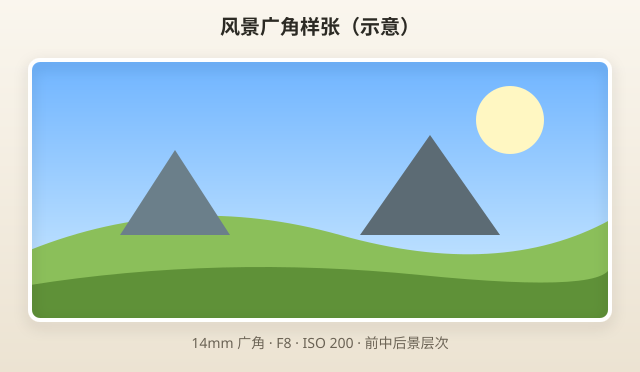
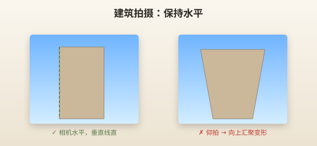

# 拍风景

> 本章涵盖旅行、街拍、建筑等「非人像为主」的日常拍摄——EP7 双镜头的实战参数。

---

## 风景新手一句话配置

```text
模式：A
镜头：14-42 @ 14～17mm（大场景） / 40-150 @ 80～150mm（远景）
光圈：F5.6～F8
ISO：AUTO（通常 200～400）
对焦：单点，对画面 1/3 处或无穷远标志
曝光补偿：0；天空很亮时 -0.3～-0.7
```



> 📷 **建议图片**：14mm 大场景风景样张；标注地平线位置。

---

## 旅行

### 用什么

| 项目 | 推荐 |
|------|------|
| 镜头 | 14-42 为主，远景换 40-150 |
| 模式 | A |
| 光圈 | F5.6～F8 |
| 焦段 | 14mm 地标+人，25mm 街景 |

### 典型场景

**地标合影**

```text
14-42 @ 14mm, A, F8, ISO AUTO
对焦中间人物，景深覆盖前后
```

**小巷街拍**

```text
14-42 @ 17～25mm, A, F5.6
快门 ≥1/125  handheld
```

**远山/对岸**

```text
40-150 @ 100～150mm, A, F5.6～F8
```

### 常见错误

| 错误 | 解决 |
|------|------|
| 什么都用广角 | 远景换长焦 |
| 地平线歪 | 开水平仪（MENU → 水平 gauge） |
| 天空过曝 | 曝光补偿 -0.3 或 SCN 逆光 HDR |

---

## 街拍

### 用什么

```text
镜头：14-42 @ 17～25mm（融入环境）或 40-150 @ 80mm（远距离）
模式：A
光圈：F5.6
ISO：AUTO
快门：≥1/250（动态街头）
```

### 技巧

- **提前对焦**：半按快门预对焦在马路上
- **连拍**：行人走过时 H 连拍
- **低调**：长焦 80mm 街角偷拍更有层次

### 常见错误

| 错误 | 说明 |
|------|------|
| 怼脸拍陌生人 | 尊重距离，长焦或广角环境 |
| 1/30 秒 handheld | 糊——提 ISO |

---

## 建筑

### 用什么

```text
镜头：14-42 @ 14mm（整栋） / 40-150 @ 80mm（局部）
模式：A 或 AP → 梯形校正
光圈：F8
```

### 14mm 拍整栋

- 相机尽量**水平**，减少 converging verticals（向中心汇聚）
- 仰拍必然「倒梯形」——可 AP 梯形校正或后期

```
      │  ← 建筑垂直线
      │     相机水平时更直
   ───┴───
```



> 📷 **建议图片**：仰拍 vs 水平拍建筑对比。

### 40-150 拍细节

窗户、纹理、对称——80～100mm 压缩感好。

### 常见错误

| 错误 | 后果 |
|------|------|
| 14mm 极端仰角 | 建筑像要倒 |
| F3.5 | 边缘画质和景深不必要 |

---

## 纯风景（自然）

### 用什么

```text
镜头：14-42 @ 14mm
模式：A 或 SCN → 风景
光圈：F8
ISO：200（AUTO 即可）
对焦：前景 1/3 或 ∞
```

### 黄金时刻

日出后、日落前 1 小时——侧光、色彩 richest。

### 海景 / 沙滩

SCN → 海滩&雪景 或 A F8，注意 **-0.3 EV** 防高光过曝。

### 日落

SCN → 日落，或 A F8，曝光补偿 -0.3～-0.7 保留太阳层次。


> 📷 **建议图片**：SCN 日落模式样张。

---

## 美食（归入生活风景）

```text
镜头：14-42 @ 14～25mm
模式：A
光圈：F5.6
角度：45° 或 90° 俯拍
曝光补偿：+0.3～+0.7
ISO：AUTO（餐厅常 800～1600）
```

**最近 20cm**——别挡光。餐厅暖光 AUTO WB 即可。

---

## 全景

两种方式：

| 方法 | 操作 |
|------|------|
| SCN → 全景 | 按提示平移，机内拼接 |
| 后期拼接 | A F8 多张重叠，手机 App 拼 |

SCN 全景适合初学者；注意平移速度均匀。

---

## 参数总表

| 场景 | 模式 | 镜头 | 光圈 | ISO | 快门 | 对焦 |
|------|------|------|------|-----|------|------|
| 旅行合影 | A | 14-42@14 | F8 | AUTO | 自动 | 人物 |
| 街拍 | A | 14-42@25 | F5.6 | AUTO | ≥1/250 | 单点 |
| 建筑整体 | A | 14-42@14 | F8 | AUTO | 自动 | ∞/1/3 |
| 建筑细节 | A | 40-150@80 | F8 | AUTO | 自动 | 单点 |
| 自然风景 | A/SCN风景 | 14-42@14 | F8 | AUTO | 自动 | 1/3 |
| 日落 | SCN日落 | 14-42@14 | F8 | AUTO | 自动 | ∞ |
| 美食 | A | 14-42@25 | F5.6 | AUTO | ≥1/60 | 食物 |
| 远景 | A | 40-150@150 | F5.6 | AUTO | ≥1/250 | ∞ |

---

## 防抖与三脚架

| 情况 | 建议 |
|------|------|
| 白天 handheld | 防抖足够 |
| 黄昏慢门 | ISO 提高优先；或小三脚架 |
| 流水慢门 | 三脚架 + S 模式 1/4s 或 SCN |

---

## 实战 walkthrough：黄金时刻风景（日落前 1 小时分步）

风景成败一半靠光。挑日落前 1 小时（黄金时刻）出门，按步骤拍一组。

### 到场准备

```
镜头：14-42（远景备 40-150）
模式：A     光圈：F8     ISO：AUTO（通常 200）
对焦：单点对前景 1/3 处，或远景对 ∞
开：网格线 + 水平仪
曝光补偿：天空亮时 -0.3 ～ -0.7
```

### 分步拍摄

```
第 1 步｜找前景
  → 石头、花、栏杆放画面下 1/3，制造纵深

第 2 步｜定地平线
  → 天空好看 → 地平线放下 1/3
  → 地面好看 → 地平线放上 1/3
  → 别放正中

第 3 步｜控高光
  → 拍一张看回放，天空死白 → -0.3EV 再拍
  → 直到云层有细节

第 4 步｜等光
  → 太阳越低颜色越暖，多等几分钟连拍
  → 太阳入镜时 F8 可拍出星芒

第 5 步｜换长焦收局部
  → 40-150 @ 100~150mm 压缩远山/城市天际线
```

### 日落曝光对照

| 想要 | 曝光补偿 | 结果 |
|------|---------|------|
| 保留天空层次 | -0.3～-0.7 | 云和太阳有细节，地面偏暗 |
| 保留地面细节 | 0～+0.3 | 地面清楚，天空可能过曝 |
| 剪影 | -1.0～-1.5 | 前景全黑轮廓 |

> 🎯 **目标**：一次日落拍 3 组（前景纵深 / 地平线构图 / 长焦局部），回家各选 1 张。

---

## 城市街景「故事线」分步

一条街拍成一组有叙事的照片：

```
① 全景（14mm）交代环境 → 这是哪
② 中景（25mm）街道生活 → 发生什么
③ 特写（42mm 或长焦）细节 → 招牌、手、光影
④ 人（长焦 80mm 远距离）→ 街头人文
```

四张排在一起，就是一个地方的完整印象。

---

## 本章重点回顾

- 风景默认 **A + F5.6～F8 + 14-42 广角**
- 远景、压缩感 → **40-150**
- 地平线用网格/水平仪
- 天空亮 → **负曝光补偿**
- 建筑尽量水平，或 AP 梯形校正

## 常见误区

| 误区 | 真相 |
|------|------|
| 风景必须 F16 | 套头 F8 已够，F16 易 diffraction 软 |
| 永远最广角 | 25mm 街景 often 更好 |
| 不对焦就拍 | 无限远或 1/3 对焦原则 |
| 日落拍成剪影 | 要层次就负补偿或 HDR |

## 拍摄练习

1. 同一公园：14mm / 25mm / 150mm 各 3 张
2. 建筑：水平 vs 仰拍对比
3. 日落：SCN vs A F8 对比
4. 美食俯拍 5 张，练习 +0.5 EV
5. SCN 全景试 2 次

下一章：[10-夜景.md](10-夜景.md)
