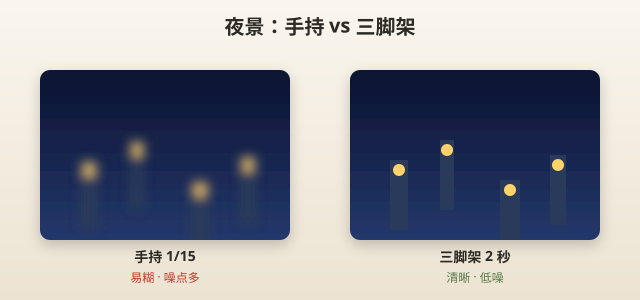
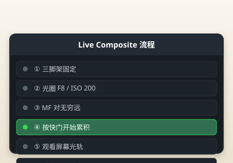
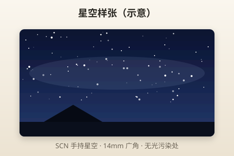

# 夜景拍摄

> 本章目标：城市夜景、烟花、星空入门——直接给参数，少讲理论。

---

## 夜景核心认知

EP7 拍夜景靠三样东西：

1. **机身防抖**（手持 1/10～1/20 秒有可能）
2. **控制 ISO**（尽量 ≤3200，能 1600 更好）
3. **三脚架**（烟花、光轨、星空几乎必须）



> 📷 **建议图片**：同夜景 handheld 糊 vs 三脚架清晰对比。

---

## 城市夜景（手持）

### 配置

```text
模式：A 或 SCN → 夜景
镜头：14-42 @ 14～25mm
光圈：F3.5～F4（尽量开大）
ISO：AUTO 或手动 1600～3200
快门：相机自动，手持尽量 ≤1/15（防抖辅助）
曝光补偿：0 或 -0.3（防灯光过曝）
对焦：单点，对亮区或 ∞
防抖：开
```

### SCN 夜景 vs A 模式

| | SCN 夜景 | A 模式 |
|---|---------|--------|
| 省心 | ⭐⭐⭐ | ⭐⭐ |
| 可控 | ⭐ | ⭐⭐⭐ |
| 推荐 | 第一次夜景 | 熟悉后 |

### 常见错误

| 错误 | 现象 |
|------|------|
| F8 手持 | 快门 1/2 秒，全糊 |
| ISO 12800 | 噪点满屏 |
| 对暗处对焦 | 拉风箱对不上 |

**技巧**：对路灯、橱窗等**亮处**对焦，再 recompose。

---

## 夜景人像

```text
模式：SCN → 人像+夜景 或 A
镜头：14-42 @ 25～42mm
光圈：F4
ISO：1600～3200
曝光补偿：+0.3（脸不要太黑）
```

可用内置闪光 **-1EV** 补脸，避免背景全黑。

---

## 烟花

### 推荐：AP → Live Composite

EP7 拍烟花的「杀手锏」——实时叠加光轨，背景亮度不变。

### 基本流程

```
1. 模式转盘 → AP → Live Composite
2. 三脚架固定
3. 镜头：14-42 @ 14mm（容纳天空范围）
4. 光圈：F8～F11
5. ISO：200
6. 对焦：手动 MF 对无穷远，或对远处亮处一次 S-AF 后改 MF
7. 按快门开始，观看屏幕光轨累积
8. 烟花结束再按快门停止
```



> 📷 **建议图片**：Live Composite 设置界面；烟花成片样张。

### 备选：SCN → 烟花

更自动，成功率也不错。三脚架仍建议。

### 参数表

| 方法 | 模式 | 镜头 | 光圈 | ISO | 支撑 |
|------|------|------|------|-----|------|
| Live Composite | AP | 14-42@14 | F8 | 200 | 三脚架 |
| SCN 烟花 | SCN | 14-42@14 | 自动 | 自动 | 三脚架 |
| 手持抓拍 | A | 14-42@14 | F4 | 3200 | 手持，单发 |

### 常见错误

| 错误 | 后果 |
|------|------|
| 手持 Live Composite | 背景糊成一片 |
| 150mm 长焦 | 框不住爆炸范围 |
| ISO 3200 + F4 长曝 | 噪点+过曝 |

---

## 光轨（车轨）

```text
模式：SCN → 光轨 或 AP → Live Composite
镜头：14-42 @ 14mm
光圈：F8～F11
ISO：200
三脚架：必须
地点：天桥、路口俯拍
```

SCN 光轨对新手最友好。

---

## 星空入门

### 手持星空（SCN）

```text
模式：SCN → 手持星空（Handheld Starlight）
镜头：14-42 @ 14mm
三脚架：强烈建议（虽叫 handheld， tripod 成功率更高）
```

EP7 防抖 + 机内堆栈，能拍「有星星」的照片，不是天文级。

### 三脚架星空（进阶）

```text
模式：M 或 A
镜头：14-42 @ 14mm（广角收星更多）
光圈：F3.5（最大）
快门：约 15～20 秒（14mm 可稍长，有拖线风险）
ISO：1600～3200
对焦：MF 无穷远，或对焦明亮星星
驱动：单张或 2s 自拍定时
```

**500 法则**（粗略）：快门秒数 ≤ 500 / 等效焦距  
14mm 等效 28 → 约 18 秒上限。

### 40-150 拍星空？

不推荐。14mm 广角才是星空入门焦段。



> 📷 **建议图片**：SCN 手持星空或三脚架星空样张。

---

## 月亮

```text
模式：M 或 S
镜头：40-150 @ 150mm
光圈：F8
快门：约 1/125～1/250
ISO：200～400
三脚架：必须
对焦：MF 无穷远 或 S-AF 对月亮后锁 MF
测光：点测光月亮，或 M 模式试拍微调
曝光补偿：月亮很亮，常需 -1～-2 EV
```

150mm 月亮仍较小——可裁切 LF JPEG（2000 万像素有余量）。

**别信「手机拍超大月亮」**——很多是 AI 合成。相机拍的是真实光学。

---

## 演唱会 / 暗光活动

```text
模式：A
镜头：40-150 @ 100～150mm
光圈：F5.6
ISO：3200～6400（临时提高上限）
快门：≥1/125
对焦：单点，预对焦舞台
驱动：H 连拍
```

**预期管理**：噪点会有，糊片会有——连拍选最好的。

---

## 静音拍摄

博物馆、演出部分场景：

```text
SCN → 静音 或 AP → 静音
电子快门，无机械声
注意：某些灯光下 banding
```

---

## B 模式简介（第二个月）

| 子模式 | 用途 |
|--------|------|
| BULB | 按住快门曝光 |
| TIME | 按两次起止 |
| LIVE COMP | 同 AP Live Composite |

模式转盘 → **B** → 屏幕选子模式。

---

## 夜景参数速查总表

| 场景 | 模式 | 镜头 | 光圈 | ISO | 快门 | 三脚架 |
|------|------|------|------|-----|------|--------|
| 城市 handheld | A/SCN夜景 | 14-42@17 | F4 | 1600～3200 | 自动 | 否 |
| 夜景人像 | SCN人像+夜景 | 14-42@35 | F4 | 3200 | 自动 | 否 |
| 烟花 | AP LiveComp | 14-42@14 | F8 | 200 | 累积 | 是 |
| 车轨 | SCN光轨 | 14-42@14 | F8 | 200 | 累积 | 是 |
| 星空入门 | SCN手持星空 | 14-42@14 | 自动 | 自动 | 自动 | 建议 |
| 星空三脚架 | M/A | 14-42@14 | F3.5 | 1600～3200 | 15～20s | 是 |
| 月亮 | M/S | 40-150@150 | F8 | 200～400 | 1/200 | 是 |
| 演唱会 | A | 40-150@150 | F5.6 | 6400 | ≥1/125 | 否 |

---

## 实战 walkthrough：城市夜景手持（分步，无三脚架）

第一次夜景不用带三脚架，靠 EP7 的强防抖也能拍。挑一个有灯光的街口。

```
步骤 1｜设置
  模式：A     光圈：F3.5～F4（尽量开大）
  ISO：AUTO（上限临时提到 3200）
  对焦：单点     防抖：S-IS AUTO（必开）
  曝光补偿：-0.3（防灯光过曝）

步骤 2｜对焦技巧（夜里对焦最难）
  → 把对焦点移到「路灯 / 亮橱窗」这类高对比亮处
  → 半按锁定（听到滴声）→ 保持半按，重新构图 → 按下

步骤 3｜稳住拍
  → 双肘夹紧、屏息、轻按
  → 连拍 3 张，回放选最锐

步骤 4｜检查快门
  → 回放按 INFO，快门若低于 1/15 → 再开大光圈或提 ISO
```

### 手持夜景排错

| 现象 | 原因 | 解法 |
|------|------|------|
| 整体糊 | 快门太慢+手抖 | F3.5全开、ISO↑、找栏杆靠 |
| 灯白成一团 | 过曝 | -0.7EV |
| 对不上焦 | 对着暗处 | 对亮处再重构图 |
| 噪点满屏 | ISO 6400+ | 上限压回 3200 |

---

## 实战 walkthrough：Live Composite 拍车轨（分步 + 排错）

这是 EP7 的「杀手锏」，必须三脚架。找一座能俯瞰车流的天桥。

```
步骤 1｜模式转盘 → AP → Live Composite
步骤 2｜三脚架固定，构图让车道贯穿画面
步骤 3｜光圈 F8，ISO 200
步骤 4｜对焦：S-AF 对远处路灯一次 → 切 MF 锁死（防止重新拉焦）
步骤 5｜先按一次快门「取暗场基准」（相机提示）
步骤 6｜再按快门开始 → 屏幕上车灯轨迹逐渐累积
步骤 7｜轨迹够长够满意 → 再按快门停止
```

### Live Composite 排错

| 现象 | 原因 | 解法 |
|------|------|------|
| 全黑 | 没车/时间太短 | 多等车流、延长累积 |
| 背景过曝 | ISO 太高/光圈太大 | ISO200、F8～F11 |
| 轨迹糊 | 三脚架被碰/风吹 | 稳固、用 2s 自拍触发 |
| 中途拉焦 | 用了 AF | 对焦后切 MF 锁死 |

> 🎯 **目标**：手持夜景选出 1 张清晰街景；Live Composite 拍出 1 张完整车轨。两者都成，你就跨过夜景门槛了。

---

## 本章重点回顾

- 手持夜景：**开大光圈 F4 + ISO 1600～3200 + 防抖**
- 烟花/光轨：**三脚架 + AP Live Composite 或 SCN**
- 星空：**14mm 广角**，SCN 手持星空入门
- 月亮：**40-150 @ 150 + 三脚架 + 快快门**
- 暗光接受噪点，**连拍选最锐**

## 常见误区

| 误区 | 真相 |
|------|------|
| 夜景关闭防抖 | 手持更需要防抖 |
| 烟花 handheld | 几乎必糊 |
| 星空用 150mm | 广角才收得下天 |
| ISO 100 夜景 | 快门太慢 |

## 拍摄练习

1. 家附近路灯场景：SCN 夜景 vs A F4 ISO3200
2. 找天桥：SCN 光轨 3 张（三脚架）
3. 郊外或无光污染处：SCN 手持星空
4. 满月夜：40-150 拍月亮，试 3 组快门
5. 记录：哪张 ISO 噪点你无法接受——那就是你的 ISO 上限

相关：[11-菜单详解.md](11-菜单详解.md) | [12-常见问题.md](12-常见问题.md)
