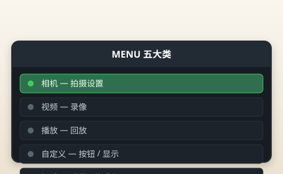

# 菜单详解

> 本章目标：不翻译整本说明书，只告诉你**哪些必改、哪些别碰、哪些以后学**。

---

## 菜单导航方式

```
MENU 键 → 左侧图标选大类 → 上下键选条目 → OK 确认
```

| 图标 | 类别 | 新手关注度 |
|------|------|-----------|
| 相机 | 拍摄相关 | ⭐⭐⭐ |
| 视频 | 录像 | ⭐ |
| 播放 | 回放设置 | ⭐⭐ |
| 自定义 | 按钮/显示 | ⭐⭐ |
| 扳手 | 设置/格式化 | ⭐⭐⭐ |

**更快的方式**：P/A/S/M 模式下按 **OK** → **超级控制面板（SCP）**，80% 日常设置在里。



> 📷 **建议图片**：MENU 五大类图标截图。

---

## 必改清单（第一天）

| 菜单路径 | 设置 | 值 |
|---------|------|-----|
| 相机 → 图片质量 | 画质 | LF |
| 相机 → ISO | AUTO 上限 | 3200 |
| 拍摄 → 防抖 | IS | S-IS AUTO |
| 拍摄 → 对焦模式 | AF | S-AF |
| 自定义 → 网格线 | 显示 | 3×3 |
| 扳手 → 格式化 | 新卡 | 执行一次 |
| 扳手 → 日期时间 | | 准确 |

详见 [03-第一次开机设置.md](03-第一次开机设置.md)。

---

## 建议改（第一～二周）

| 菜单路径 | 设置 | 推荐 | 原因 |
|---------|------|------|------|
| AF → AF 区域 | 默认区域 | 单点 | 精准对焦 |
| AF → 人脸检测 | | 开 | 人像辅助 |
| 自定义 → 水平 gauge | | 开 | 风景建筑 |
| 自定义 → 预览 | 预览效果 | 开 | WYSIWYG |
| 扳手 → 省电 | 休眠 | 1min 或 3min | 省电 |
| 播放 → 旋转 | 自动旋转 | 开 | 回放方便 |

---

## 不要碰（第一个月）

| 菜单 | 为什么 |
|------|--------|
| 像素映射 | 除非有坏点，厂家工具 |
| 固件降级 | 除非出问题 |
| 语言乱改 | 改不回去麻烦 |
| 出厂重置 | 会清所有设置 |
| RAW 相关 | 先玩 JPEG |
| 色彩空间 Adobe RGB | 新手 sRGB 即可 |
| 镜头校准微调 | 没问题的镜头别动 |
| 快门计数重置 | 无意义 |

> ⚠️ **误触出厂重置**：MENU → 扳手 → 重置 → 确认。会清空本教程所有设置。

---

## 以后再学

| 功能 | 何时学 |
|------|--------|
| RAW / RAW 编辑 | JPEG 满意后 |
| 按钮自定义（AEL/Fn） | 熟练 A 模式后 |
| 对焦包围 / 景深合成 | 微距进阶 |
| 间隔拍摄 / 延时 | 视频爱好者 |
| Wi-Fi / OI.Share 传图 | 需要手机发圈时 |
| 外接闪光灯 RC 设置 | 买外闪后 |
| 色彩 Profile 注册 | 玩直出风格时 |
| 电子快门 banding | 静音模式遇条纹时 |

---

## 超级控制面板（SCP）图标速查

按 OK 后常见图标：

| 图标含义 | 新手频率 | 说明 |
|---------|---------|------|
| ISO | 高 | AUTO/手动 |
| WB 白平衡 | 中 | 默认 AUTO |
| 测光模式 | 低 | ESP 默认 |
| AF 模式 | 高 | S-AF / C-AF |
| AF 区域 | 高 | 单点 |
| 驱动 | 中 | 单张/连拍 |
| 自拍定时 | 低 | 2s/12s |
| 闪光模式 | 中 | 强制关/自动 |
| 防抖 | 低 | 常开 |
| 曝光补偿 | 高 | A 模式前拨轮也可 |


> 📷 **建议图片**：SCP 每个图标用中文标注。

---

## 拍摄菜单（相机图标）精选

### 必须理解

| 条目 | 建议 | 说明 |
|------|------|------|
| 图片质量 | LF | 大 JPEG |
| 图片比例 | 4:3 | 默认，别改 16:9 丢像素 |
| ISO | AUTO max 3200 | |
| 降噪 | 标准 | 高 ISO 长曝降噪默认即可 |
| 白平衡 | AUTO | |

### 按需使用

| 条目 | 何时 |
|------|------|
| 连拍 H/L | 运动、儿童 |
| 自拍定时 | 合影 |
| 包围曝光 bracketing | 进阶 HDR |
| 静音 / 静音快门 | 博物馆 |

### 可忽略

| 条目 | 说明 |
|------|------|
| 镜头 Info | 看 attached lens |
| 多重测光细节 | ESP 够用 |

---

## AF 菜单精选

| 条目 | 新手设置 |
|------|---------|
| 对焦模式 | S-AF |
| AF 区域 | 单点 / 小群 |
| 人脸检测 | 开 |
| 对焦锁定 | AEL 默认（进阶） |
| 对焦 peaking | MF 时用 |

**C-AF + TR（追踪）**：第二个月拍宠物再开。

---

## 自定义菜单精选

| 条目 | 建议 |
|------|------|
| 网格线 | 3×3 |
| 水平 gauge | 开 |
| 直方图 | 学曝光后开 |
| 高光警告 | 可选开 |
| 按钮功能 | 默认，熟悉后改 Fn |
| 拨盘功能 | A 模式后拨轮=光圈（默认） |

### Fn / AEL 按钮

默认：

- **AEL/AFL**：曝光/对焦锁定
- **Fn（快门旁 Shortcut）**：SCN/AP/ART 子模式切换

第一个月**不用改**。

---

## 播放菜单精选

| 条目 | 用途 |
|------|------|
| 旋转显示 | 自动 |
| 幻灯片 | 电视 HDMI 输出 |
| 编辑 | 机内裁剪、黑白——应急 |
| RAW 编辑 | 有 RAW 才用 |

---

## 设置菜单（扳手）精选

| 条目 | 说明 |
|------|------|
| 格式化 | 清空 SD 卡 |
| 日期时间 | |
| 固件更新 | 偶尔检查 |
| USB 模式 | 充电 / 存储 |
| Wi-Fi | 传手机 |
| 省电 | 自动关机时间 |
| 传感器清洁 | 换镜头后自动振动 |

---

## 视频菜单（简要）

| 条目 | 新手建议 |
|------|---------|
| 分辨率 | 1080p 60fps 日常 |
| 4K | 需要裁切时再用 |
| 麦克风 | 机内立体声，无外接口 |
| 防抖 | 开，但视频防抖弱于拍照 |

---

## 菜单 vs SCP：什么时候进 MENU？

| 需求 | 用哪个 |
|------|--------|
| 改 ISO/WB/AF | SCP（OK 键） |
| 改画质 RAW/LF | MENU |
| 格式化 | MENU |
| 网格线 | MENU |
| 固件更新 | MENU |
| 曝光补偿 | 前拨轮（A 模式） |

**原则**：能 SCP 就不 MENU，少迷路。

---

## 新手菜单学习路线

```
第 1 天：画质、ISO、格式化、日期
第 1 周：SCP 全部图标认一遍
第 2 周：AF 菜单、网格、水平仪
第 1 月：播放编辑、Wi-Fi 传图
第 2 月：按钮自定义、RAW、间隔拍摄
```

---

## 实战 walkthrough：SCP 逐图标认一遍（10 分钟）

按 OK 打开超级控制面板，跟着把最常用的图标点一遍，建立「肌肉记忆」。

```
步骤 1｜P/A/S/M 任一模式 → 按 OK
步骤 2｜十字键依次高亮，转拨轮改值，逐个熟悉：

  ① ISO       → 试着在 AUTO / 800 / 3200 间切换
  ② WB        → AUTO / 白炽灯，看画面色调变化
  ③ AF 模式    → S-AF ↔ C-AF
  ④ AF 区域    → 单点 ↔ 小群点
  ⑤ 驱动       → 单张 ↔ H 连拍
  ⑥ 曝光补偿   → -1 / 0 / +1，看画面明暗
  ⑦ 闪光       → 关 ↔ 强制

步骤 3｜半按快门退出，随手拍一张验证
```

> ✅ **过关**：闭着菜单也能在 30 秒内把 ISO、WB、AF 三项改对。

---

## 分步：菜单迷路自救

新手常在 MENU 里找不到东西。记住这套「回家路线」：

```
不确定改哪 → 先按 OK 试 SCP（80% 设置都在）
SCP 没有   → MENU → 按大类图标定位：
   画质/ISO/降噪 …… 相机图标
   对焦相关 ……… AF 菜单
   网格/按钮/显示 … 自定义（齿轮）
   格式化/时间/固件 … 扳手
找不到就退 → 半按快门直接回到拍摄，不会改坏
误入危险项 → 看到「重置/格式化」别乱确认
```

### 必改项一次设置分步（第一天照做）

```
1. 相机 → 图片质量 → LF
2. 相机 → ISO → AUTO，上限 3200
3. AF → 对焦模式 → S-AF；区域 → 单点
4. 拍摄 → 防抖 → S-IS AUTO
5. 自定义 → 网格线 → 3×3
6. 扳手 → 格式化（新卡）→ 日期时间
```

---

## 本章重点回顾

- **OK = SCP** 是日常主力
- 必改：LF、ISO 上限 3200、S-AF、格式化
- 第一个月**别碰**：重置、RAW、镜头校准
- 人脸检测、网格、水平仪——第二周开
- 菜单深不必全背，按本清单即可

## 常见误区

| 误区 | 真相 |
|------|------|
| 菜单要全背 | SCP + 10 项足够 |
| 关掉所有降噪 | 标准即可 |
| Adobe RGB 更专业 | 不后期就 sRGB |
| 乱改按钮 | 默认先学标准操作 |

## 拍摄练习

1. 闭卷操作：MENU 找到格式化（不执行）、图片质量、ISO 上限
2. SCP 练习：30 秒内改 ISO、WB、AF 模式
3. 开启网格+水平仪，拍 3 张风景
4. 浏览 AF 菜单，确认 S-AF + 单点 + 人脸开
5. 记录 3 个你「找不到」的菜单项，对照说明书索引

问题排查 → [12-常见问题.md](12-常见问题.md)
