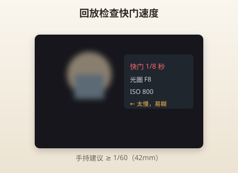
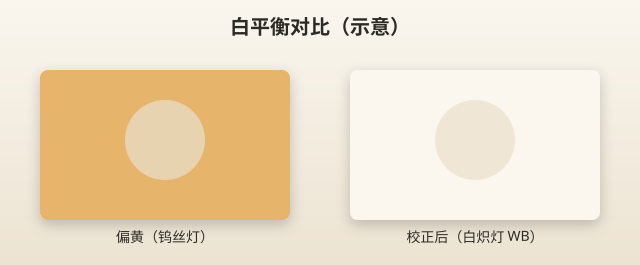

# 常见问题

> 本章目标：照片出问题时的「急救手册」——按现象找原因、按原因给解法。

---

## 使用方式

1. 找到你的问题标题
2. 看「最可能原因」
3. 按顺序试「解决步骤」
4. 仍不行 → 查说明书或售后

---

## 为什么照片模糊？

### 最可能原因（按概率）

| 排名 | 原因 | 典型场景 |
|------|------|---------|
| 1 | 快门太慢，手抖 | 室内 F8、暗光 |
| 2 | 对焦错了 | 对背景、对太近 |
| 3 | 主体在动 | 小孩、宠物 |
| 4 | 镜头脏 / 雾 | 指纹、冬天进暖室 |
| 5 | 镜头没锁紧 | 罕见但严重 |

### 解决步骤

```
1. 回放 → 按 INFO 看快门速度
   - 手持：快门 ≥ 1/焦距等效（42mm → 1/60+）
   - 150mm → 1/250+
2. 快门太慢 → 开大光圈 F4 或提高 ISO
3. 检查对焦框是否在主体上
4. 运动主体 → C-AF 连拍 或 SCN 儿童/运动
5. 擦镜头；确认镜头「咔」锁紧
6. 确认防抖开启（S-IS AUTO）
```



> 📷 **建议图片**：回放界面显示快门 1/8 秒的糊片截图。

---

## 为什么背景不虚？

### 原因

| 原因 | 说明 |
|------|------|
| 光圈太小 | F8 背景更实 |
| 焦段太短 | 14mm 广角难虚化 |
| 离主体太远 | 套头常见 |
| 主体离背景太近 | 物理限制 |
| M4/3 景深较深 | 系统特性 |

### 解决步骤

```
1. A 模式 → F4 或 F3.5（14-42 广角端）
2. 用 42mm 或 40-150 @ 80mm+
3. 靠近主体（最近 0.2m/0.9m 注意）
4. 让主体离背景尽量远（1m+）
5. 接受套头极限——或日后 F1.8 定焦
```

**对比测试**：同一人，14mm F3.5 vs 42mm F5.6 vs 150mm F5.6。

---

## 为什么颜色不好？

| 现象 | 原因 | 解决 |
|------|------|------|
| 偏黄 | 钨丝灯 | WB 白炽灯或 AUTO |
| 偏蓝 | 阴天/shade | AUTO 通常 OK |
| 发灰 | 曝光不足 | +0.3～+0.7 EV |
| 过饱和 | ART 滤镜 | 关 ART，标准模式 |
| 肤色脏 |  Mixed 光 | 找单一光源 |



> 📷 **建议图片**：AUTO vs 白炽灯 WB 餐厅对比。

第一个月：**AUTO WB + 曝光补偿** 解决 90%。

---

## 为什么夜景噪点很多？

| 原因 | 解决 |
|------|------|
| ISO 太高（6400+） | 上限改 3200；或接受 3200 |
| 强行提亮 JPEG | 曝光时 +EV，别后期拉 |
| 长曝光降噪关 | 默认标准即可 |
| 和手机比 | 手机多帧降噪，相机单帧更「真实」 |

**改善**：

- 三脚架 → ISO 200 + 慢门
- 手持 → F4 + ISO 1600～3200，别 F8

---

## 为什么自动对焦失败？

| 现象 | 原因 | 解决 |
|------|------|------|
| 拉风箱 | 太暗、低对比 | 对亮处；辅助 AF 灯 |
| 一直糊 | 最近距离内 | 14-42 退到 20cm 外 |
| 对不上 | 玻璃/栅栏 | 开大光圈无效，换角度 |
| 人脸错 | 多人 | 改单点手动选对 |
| 视频 AF 慢 | 反差 AF 特性 | 单次对焦后开拍 |

**低光 AF 技巧**：对路灯、橱窗，半按锁定， recompose。

---

## 为什么曝光不正常？

| 现象 | 原因 | 解决 |
|------|------|------|
| 脸黑背景亮 | 逆光 | +0.7～+1.0 EV 或 HDR |
| 天空一片白 | 过曝 | -0.3～-0.7 EV |
| 整体偏暗 | 相机保守 | +0.3 EV |
| 闪烁条纹 | 荧光灯 | 防闪烁 AUTO |
| 夜景过曝 | SCN 误判 | 改 A 手动控 |

**A 模式**：前拨轮改曝光补偿是最快手段。

---

## 为什么照片比手机差？

| 手机优势 | 相机要补的课 |
|---------|-------------|
| 计算摄影 HDR | 曝光补偿、SCN HDR |
| 人像模式算法虚化 | 物理虚化技巧 |
| 自动分享优化 | 机内 Profile / ART |
| 随时在口袋 | 你愿意带 EP7 吗？ |

**真实差距**：光学变焦（40-150）、暗光细节、打印放大——学会设置后会反超。

**检查清单**：

- [ ] 是否 LF 画质？
- [ ] 是否对焦准确？
- [ ] 是否用了 A 而非 iAUTO 乱闪？
- [ ] 是否和大太阳下看不清屏幕有关？

---

## 为什么人物脸发黑？

| 场景 | 解决 |
|------|------|
| 逆光 | +1.0 EV；SCN 逆光 HDR |
| 帽子阴影 | 让人脸转向光 |
| 背景太亮 ESP 测光 | 点测光人脸或 +EV |
| 闪光未开 | 室内强制闪光 -1EV |

---

## 为什么屏幕看不清？

EP7 **无取景器**，强光下常见问题。

| 方法 | 说明 |
|------|------|
| 找阴影 | 最实用 |
| 手挡屏幕上方 | 临时遮光罩 |
| 调高亮度 | MENU 显示设置 |
| 翻转角度 | 减少反光 |
| 戴偏光墨镜 | 会看不清——摘墨镜 |

不是故障，是设计取舍。

---

## 为什么镜头伸不出来 / 缩不回去？

| 情况 | 说明 |
|------|------|
| 14-42 EZ 开机不伸 | 检查镜头是否锁紧；换电池 |
| 关机缩回 | **正常** |
| 卡住 | 关机，轻助转动，勿蛮力 |
| 40-150 无伸缩 | **正常**，机械变焦手动拧 |

---

## 为什么 SD 卡报错？

| 原因 | 解决 |
|------|------|
| 新卡未格式化 | MENU 格式化 |
| 卡速不够拍 4K | 换 U3 / UHS-II |
| 卡满 | 删除或换卡 |
| 卡接触不良 | 重新插入 |
| 假卡 | 正品渠道买 |

---

## 为什么 Wi-Fi 连不上手机？

| 步骤 | 操作 |
|------|------|
| 1 | 手机装 OI.Share 或 OM Image Share |
| 2 | 相机 MENU → Wi-Fi → 简单连接 / QR |
| 3 | 关闭相机省电立即断连 |
| 4 | 传图时停止 USB 充电冲突 |

第一个月可以不学 Wi-Fi，数据线或读卡器复制。

---

## 为什么闪光灯不弹 / 不闪？

| 原因 | 解决 |
|------|------|
| 闪光模式关 | SCP 改自动或强制开 |
| iAUTO 白天不需要 | 正常 |
| 充电中 | 某些操作限制 |
| 手动压回 | 按闪光按钮弹出 |

---

## 为什么连拍很慢 / 停拍？

| 原因 | 说明 |
|------|------|
| SD 卡慢 | 换 UHS-I U3 以上 |
| 缓冲满 | 等写入完成 |
| 用 Silent 连拍 | 速度不同 |
| 4K 视频发热 | 休息再拍 |

---

## 为什么照片有污点 / 黑点在固定位置？

传感器进灰。换镜头时**关机、镜头朝下、快换**。

- 小光圈 F16 拍天空可见污点——**日常 F5.6 不明显**
- MENU → 像素映射（官方建议流程）
- 严重 → 清洁服务

---

## 为什么 ART 滤镜拍完无法变回普通？

ART 模式 JPEG 带滤镜，**非 RAW 无法撤销**。

解决：重要场合用 A 模式；ART 当创意副本。

---

## 为什么 4K 视频抖？

| 原因 | 解决 |
|------|------|
| 视频防抖有限 | 1080p + 广角 14mm |
| 手持长焦 | 别用 150mm 拍视频 |
| 走路拍摄 | 稳定器或三脚架 |

拍照防抖 ≠ 视频防抖同样强。

---

## 快速诊断流程图

```
照片不满意
    │
    ├─ 模糊？ → 看快门 → 提 ISO / 开大光圈 / 三脚架
    │
    ├─ 太暗/太亮？ → 曝光补偿 ±
    │
    ├─ 颜色怪？ → WB AUTO / ±EV
    │
    ├─ 对不上焦？ → 单点对主体 / 够亮
    │
    └─ 和手机比？ → 检查设置 + 光学变焦场景
```

---

## 何时该找售后？

- 新镜/new 机镜头异响异常大
- 传感器明显划痕
- 充电灯狂闪无法充进
- 按键无反应（重启无效）
- 严重偏色所有设置无效

---

## 实战 walkthrough：照片不满意「5 分钟自检」（分步）

拍完觉得不对劲，别瞎猜。按这套流程走一遍，90% 问题当场定位。

```
第 1 步｜回放 + 按 INFO 看参数
  → 记下快门、光圈、ISO

第 2 步｜判「糊」还是「脏」还是「暗」
  · 糊  → 看快门：<1/60 且手持？→ 手抖，提 ISO/开光圈/找支撑
  · 脏(噪点) → 看 ISO：>3200？→ 压 ISO 上限、别硬提亮
  · 暗/亮 → 曝光补偿：暗+0.3~1，亮-0.3~0.7

第 3 步｜判对焦
  → 放大主体：清吗？主体虚背景清=对错地方
  → 改单点，压在主体（人像=眼睛）重拍

第 4 步｜判颜色
  → 偏黄/偏蓝？→ WB 一般 AUTO 够；极端光源手动选

第 5 步｜复拍验证
  → 按上面结论改 1 个参数，重拍同一场景对比
```

### 三个真实案例（照着诊断）

**案例 1：室内孩子照片全糊**
```
EXIF：F8, 1/15, ISO 400
诊断：F8 太小→快门被拖到 1/15→手抖+孩子动
处方：改 F4，ISO 上限放 3200，快门升到 1/200，H 连拍
```

**案例 2：逆光人脸黑**
```
EXIF：F5.6, 1/500, 0EV，背后是窗
诊断：ESP 测光被亮背景骗，脸欠曝
处方：曝光补偿 +1.0，或 SCN 逆光 HDR，或闪光 -1EV 补脸
```

**案例 3：夜景噪点多且发灰**
```
EXIF：F8, 1/8, ISO 6400，事后又拉亮
诊断：ISO 过高 + 后期硬提亮
处方：F3.5 全开、ISO 回 3200、拍时 +EV 一次到位；有三脚架就 ISO200 慢门
```

> 🎯 **养成习惯**：每次不满意都先看 EXIF 再改**一个**参数复拍。改一个变量才知道是什么在起作用。

---

## 本章重点回顾

- 糊片第一查 **快门速度**
- 背景不虚 → **F4 + 长焦 + 靠近**
- 脸黑 → **逆光 +EV**
- 噪点 → **控 ISO 3200 + 三脚架夜景**
- 比手机差 → 多半是 **设置和场景** 不是相机差

## 常见误区

| 误区 | 真相 |
|------|------|
| 糊了就是相机坏 | 90% 快门或对焦 |
| 噪点是 EP7 不行 | ISO 6400 任何小传感器都脏 |
| 手机永远更好 | 各擅长不同场景 |
| 屏幕看不清要维修 | 无 EVF 的常态 |

## 拍摄练习

1. **故意糊片**：1/10 秒 handheld 1 张，再 1/250 1 张对比
2. **虚化对比**：14 F3.5 vs 150 F5.6 同背景
3. **逆光 +0 / +1.0** 人脸亮度对比
4. **ISO 3200 vs 6400** 夜景噪点对比
5. 建立个人「问题日志」：记录 5 次失败及原因

---

## 全书完结

恭喜你读完《从零开始使用 EP7》。

**记住三条**：

1. 日常 **A 模式 + F5.6 + ISO AUTO**
2. 14-42 挂机，要拉近换 **40-150**
3. 糊了看快门，暗了加 EV，虚了换焦段

继续拍，比继续读更重要。

---

## 想继续进阶？

基础篇到此结束。当你用熟 A 模式后，可以进入**进阶篇**：

- [13-RAW后期入门.md](13-RAW后期入门.md) —— 对 JPEG 不满意时学后期
- [14-视频与Vlog.md](14-视频与Vlog.md) —— 拍视频和 Vlog
- [15-旅行摄影.md](15-旅行摄影.md) —— 一次旅行的完整拍摄流程
- [16-术语表.md](16-术语表.md) —— 名词速查

回到 [README.md](README.md) 查看学习路线。
