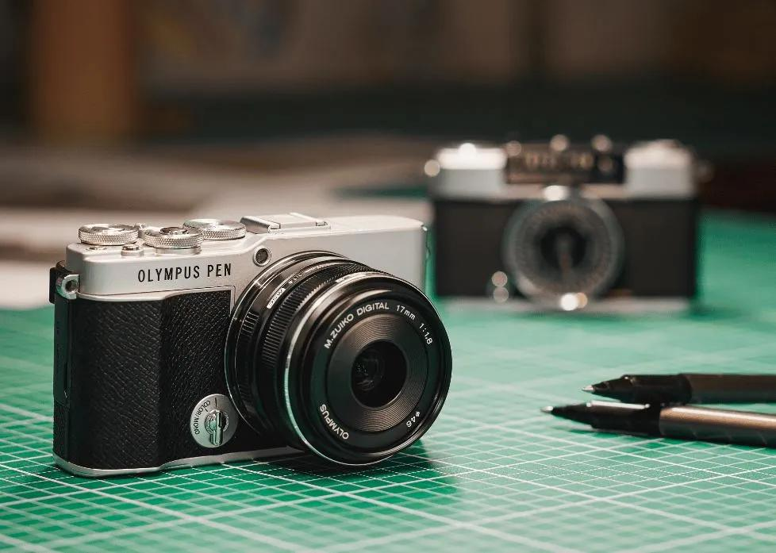

# 从零开始使用 Olympus PEN E-P7

> 一本写给零基础新手的 EP7 实用教程  
> 套装：E-P7 + M.Zuiko 14-42mm F3.5-5.6 EZ + M.Zuiko 40-150mm F4.0-5.6 R

> **在线阅读（推荐）**：[打开 EP7 网页版（侧边栏目录）](index.html) — 手机可「添加到主屏幕」。  
> 本页为 Markdown 目录；在 [知识库 Docsify 站](https://valentine-8.github.io/learning-knowledge-base/#/奥林巴斯ep7/EP7-Guide/README.md) 内点下方章节链接亦可阅读。

---

## 这本书是写给谁的？

如果你：

- 以前几乎没用过相机，只会用手机拍照
- 刚买了（或准备买）EP7 双镜头套装
- 不想啃 200 页官方说明书
- 希望**尽快拍出满意的照片**

那么这本书就是为你写的。

---

## 目录

| 章节 | 文件 | 你会学到什么 |
|------|------|-------------|
| 第 0 章 | [01-第一次拿到EP7.md](01-第一次拿到EP7.md) | 开箱、装镜头、充电、插卡 |
| 第 1 章 | [02-认识EP7.md](02-认识EP7.md) | EP7 是什么、优缺点、适合谁 |
| 第 2 章 | [03-第一次开机设置.md](03-第一次开机设置.md) | 开机前必做的 10 项设置 |
| 第 3 章 | [04-模式转盘.md](04-模式转盘.md) | AUTO / P / A / S / M / SCN / ART / AP 全解 |
| 第 4 章 | [05-14-42EZ镜头.md](05-14-42EZ镜头.md) | 标准变焦「饼干头」怎么用 |
| 第 5 章 | [06-40-150R镜头.md](06-40-150R镜头.md) | 长焦镜头拍什么、何时换 |
| 第 6 章 | [07-第一次出去拍照.md](07-第一次出去拍照.md) | 出门前的「一键配置清单」 |
| 第 7 章 | [08-拍人像.md](08-拍人像.md) | 人像模式、光圈、光线 |
| 第 8 章 | [09-拍风景.md](09-拍风景.md) | 旅行、建筑、街拍 |
| 第 9 章 | [10-夜景.md](10-夜景.md) | 夜景、烟花、星空入门 |
| 第 10 章 | [11-菜单详解.md](11-菜单详解.md) | 哪些菜单必改、哪些别碰 |
| 第 11 章 | [12-常见问题.md](12-常见问题.md) | 模糊、过曝、对焦失败…… |

### 进阶篇（第二个月起）

| 章节 | 文件 | 你会学到什么 |
|------|------|-------------|
| 第 12 章 | [13-RAW后期入门.md](13-RAW后期入门.md) | RAW 是什么、后期五步流程、软件选择 |
| 第 13 章 | [14-视频与Vlog.md](14-视频与Vlog.md) | 1080p Vlog、快门守则、稳定与收音 |
| 第 14 章 | [15-旅行摄影.md](15-旅行摄影.md) | 打包、当天节奏、备份、故事线 |
| 附录 | [16-术语表.md](16-术语表.md) | 全书名词「人话」速查 |

---

## 新手学习路线

### 第一天（2～3 小时）

1. 阅读 [01-第一次拿到EP7](01-第一次拿到EP7.md) —— 完成开箱、装镜头、充电
2. 阅读 [02-认识EP7](02-认识EP7.md) —— 了解你的相机
3. 阅读 [03-第一次开机设置](03-第一次开机设置.md) —— 完成基础设置
4. **在家拍 20 张**：桌子上的杯子、窗外的树、镜子里自己的脸

> **目标**：能开机、能对焦、能按快门、能在回放里看到照片。

### 第二天（1～2 小时）

1. 阅读 [04-模式转盘](04-模式转盘.md) 的 **AUTO** 和 **A 模式** 两节
2. 阅读 [05-14-42EZ镜头](05-14-42EZ镜头.md)
3. **出门拍 30 张**：小区、便利店、路边花

> **目标**：理解 A 模式，知道用前拨轮调光圈。

### 第三天（1～2 小时）

1. 继续 [04-模式转盘](04-模式转盘.md) 的 **SCN 场景模式**
2. 阅读 [07-第一次出去拍照](07-第一次出去拍照.md)
3. **按清单设置相机**，再拍 30 张

> **目标**：形成「出门前三分钟检查清单」的习惯。

### 第一周末（累计 3～5 天）

| 天 | 任务 |
|----|------|
| 第 4 天 | 读 [06-40-150R镜头](06-40-150R镜头.md)，练习换镜头 |
| 第 5 天 | 读 [08-拍人像](08-拍人像.md)，给朋友或家人拍 20 张 |
| 第 6 天 | 读 [09-拍风景](09-拍风景.md)，去公园或城市走走 |
| 第 7 天 | 复习 [12-常见问题](12-常见问题.md)，整理本周最佳 5 张照片 |

> **第一周目标**：
> - 熟练使用 **A 模式**
> - 会换两支镜头
> - 知道 ISO、光圈、快门的大致作用
> - 能拍清楚人像和风景

### 第二～四周

- 尝试 **P 模式** 和 **SCN 场景模式**
- 阅读 [10-夜景](10-夜景.md)，找机会拍一次夜景
- 阅读 [11-菜单详解](11-菜单详解.md)，按需调整 2～3 个菜单
- 每周至少出门拍一次，每次 50 张以上

### 一个月以后

| 主题 | 建议学习 |
|------|---------|
| S 模式 | 拍运动、宠物奔跑 |
| M 模式 | 理解曝光三要素的关系 |
| AP 高级模式 | Live Composite 拍烟花/光轨 |
| ART 艺术滤镜 | 创意表达，Instagram 直出 |
| RAW 后期 | 见 [13-RAW后期入门.md](13-RAW后期入门.md) |
| 视频 / Vlog | 见 [14-视频与Vlog.md](14-视频与Vlog.md) |
| 旅行摄影 | 见 [15-旅行摄影.md](15-旅行摄影.md) |
| 外接闪光灯 | 室内人像进阶 |

---

## 我的推荐：新手默认配置

如果你懒得记太多，**平时就用这一套**：

```
模式转盘 → A（光圈优先）
光圈     → F4～F5.6（14-42）或 F5.6（40-150）
ISO      → AUTO（上限设为 3200）
白平衡   → AUTO
图片质量 → LF（大 JPEG，约 20MP）
对焦     → 单点 AF（S-AF）
防抖     → 开启（默认）
曝光补偿 → 0，太暗就 +0.3～+1.0
镜头     → 白天用 14-42，需要「拉近」再换 40-150
```

---

## 关于图片

本书在需要插图的位置预留了 Markdown 图片引用，例如：

```markdown

```

请将你拍摄或截屏的图片放入 `images/` 对应子文件夹。每处占位符下方都标注了**建议放入什么图片**。

---

## 重要提醒

1. **EP7 没有取景器**，强光下看屏幕可能吃力——尽量找阴影处构图，或调高屏幕亮度。
2. **14-42 EZ 是电动变焦**，变焦环是电子的，关机后镜头会自动收回。
3. **换镜头前务必关机**，避免进灰。
4. 品牌已更名为 **OM SYSTEM**，但相机菜单里可能仍显示 OLYMPUS——功能一样，不必困惑。

---

## 开始学习

打开 [01-第一次拿到EP7.md](01-第一次拿到EP7.md)，从开箱第一步开始。

祝你拍得开心。
